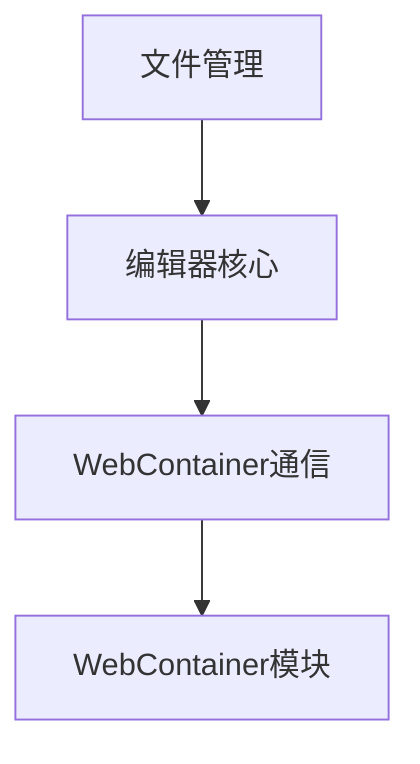
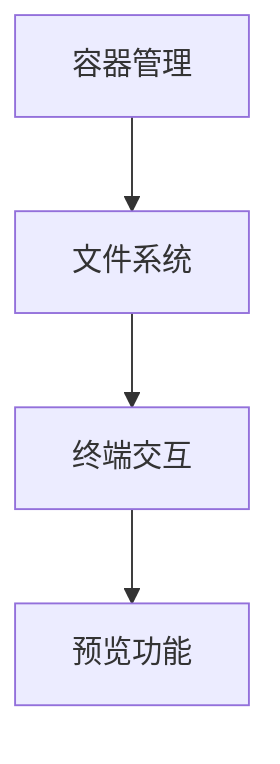

# 新版架构设计方案

## 1. 整体架构概述

本项目是基于WebContainer技术的在线代码编辑器，主要包含两大核心模块：
- **编辑器模块**：提供代码编辑功能
- **WebContainer模块**：提供代码执行环境

## 2. 模块交互设计

### 2.1 编辑器模块


### 2.2 WebContainer模块


## 3. 关键Hook更新

### 3.1 终端Hook
```typescript
const { 
  tabs,
  activeTabId,
  isExpanded,
  isRunning,
  getActiveTab,
  addTab,
  closeTab,
  switchTab,
  executeCommand,
  clearTerminal,
  toggleExpanded,
  setExpanded
} = useTerminal();
```

### 3.2 预览Hook
```typescript
const { 
  url,
  viewMode,
  isLoading,
  isRunning,
  refresh,
  updateUrl,
  changeViewMode,
  openInNewWindow,
  handleIframeLoad,
  getPreviewSize
} = usePreview();
```

## 4. 目录结构调整建议

建议采用以下目录结构：
```
src/
├── components/
│   ├── Editor/
│   │   ├── core/
│   │   ├── fileSystem/
│   │   └── webContainer/
│   └── WebContainer/
│       ├── Core/
│       ├── Terminal/
│       └── Preview/
└── hooks/
    ├── editor/
    └── webcontainer/
```

## 5. 后续优化计划

1. 完善类型定义
2. 优化性能监控
3. 增强错误处理机制
4. 实现更精细的文件同步控制