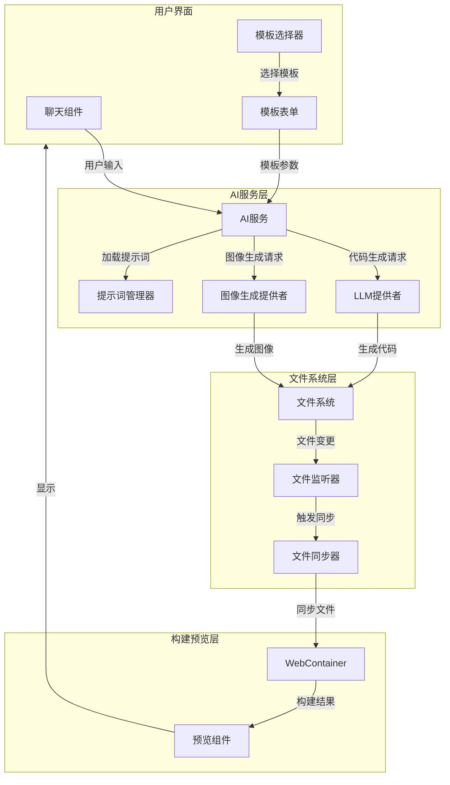
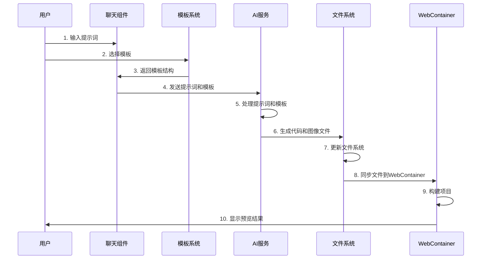
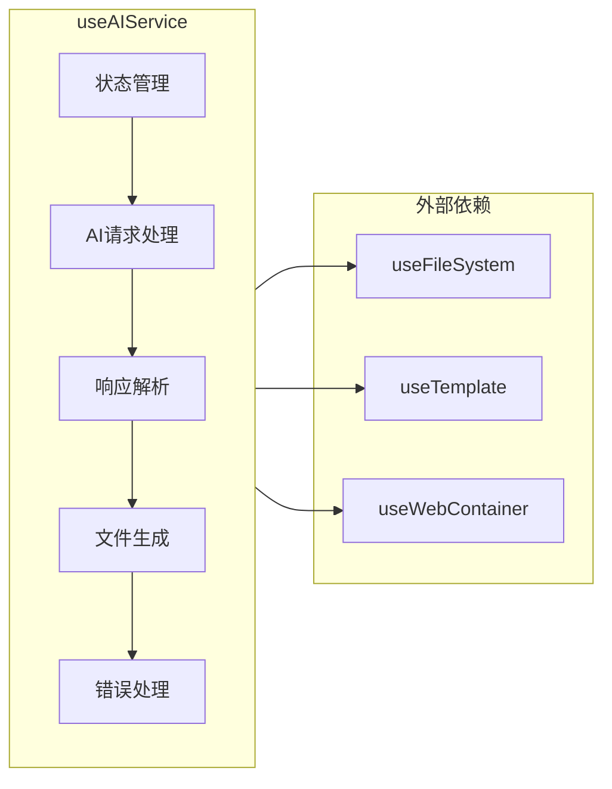
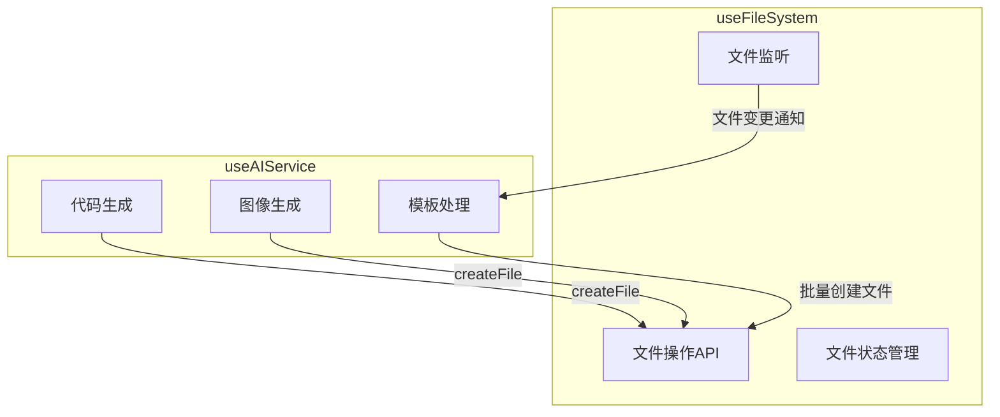
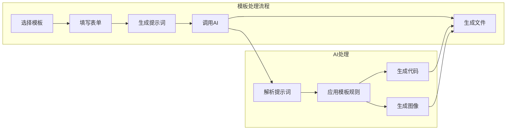
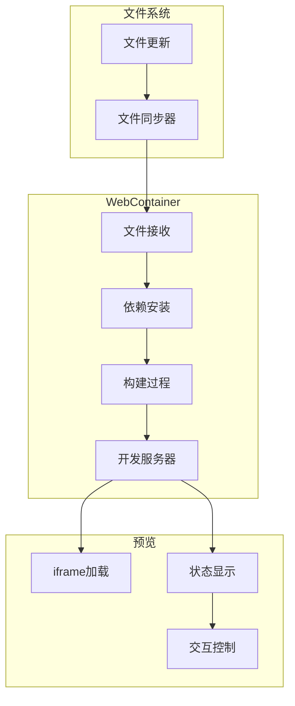
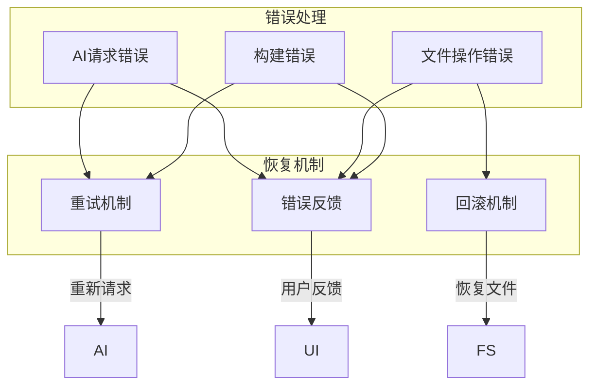
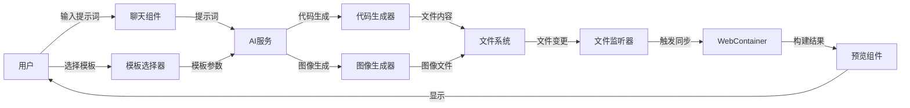

# AI LLM 功能架构设计

## 1. 整体架构图

```mermaid
flowchart TB
    subgraph 用户界面
        Chat[聊天组件]
        TemplateSelector[模板选择器]
        TemplateForm[模板表单]
    end
    
    subgraph AI服务层
        AIService[AI服务]
        LLMProvider[LLM提供者]
        ImageGenProvider[图像生成提供者]
        PromptManager[提示词管理器]
    end
    
    subgraph 文件系统层
        FileSystem[文件系统]
        FileWatcher[文件监听器]
        FileSync[文件同步器]
    end
    
    subgraph 构建预览层
        WebContainer[WebContainer]
        Preview[预览组件]
    end
    
    Chat --> |用户输入| AIService
    TemplateSelector --> |选择模板| TemplateForm
    TemplateForm --> |模板参数| AIService
    
    AIService --> |代码生成请求| LLMProvider
    AIService --> |图像生成请求| ImageGenProvider
    AIService --> |加载提示词| PromptManager
    
    LLMProvider --> |生成代码| FileSystem
    ImageGenProvider --> |生成图像| FileSystem
    
    FileSystem --> |文件变更| FileWatcher
    FileWatcher --> |触发同步| FileSync
    FileSync --> |同步文件| WebContainer
    
    WebContainer --> |构建结果| Preview
    Preview --> |显示| 用户界面
```

## 2. 核心模块交互流程

```mermaid
sequenceDiagram
    participant User as 用户
    participant Chat as 聊天组件
    participant Template as 模板系统
    participant AI as AI服务
    participant FS as 文件系统
    participant WC as WebContainer
    
    User->>Chat: 1. 输入提示词
    User->>Template: 2. 选择模板
    Template->>Chat: 3. 返回模板结构
    Chat->>AI: 4. 发送提示词和模板
    AI->>AI: 5. 处理提示词和模板
    AI->>FS: 6. 生成代码和图像文件
    FS->>FS: 7. 更新文件系统
    FS->>WC: 8. 同步文件到WebContainer
    WC->>WC: 9. 构建项目
    WC->>User: 10. 显示预览结果
```

## 3. AI服务钩子设计

```mermaid
flowchart LR
    subgraph useAIService
        A[状态管理] --> B[AI请求处理]
        B --> C[响应解析]
        C --> D[文件生成]
        D --> E[错误处理]
    end
    
    subgraph 外部依赖
        FS[useFileSystem]
        Template[useTemplate]
        WC[useWebContainer]
    end
    
    useAIService --> FS
    useAIService --> Template
    useAIService --> WC
```

## 4. 文件系统钩子与AI集成

```mermaid
flowchart TB
    subgraph useFileSystem
        FS1[文件操作API]
        FS2[文件状态管理]
        FS3[文件监听]
    end
    
    subgraph useAIService
        AI1[代码生成]
        AI2[图像生成]
        AI3[模板处理]
    end
    
    AI1 --> |createFile| FS1
    AI2 --> |createFile| FS1
    AI3 --> |批量创建文件| FS1
    
    FS3 --> |文件变更通知| AI3
```

## 5. 模板与AI集成流程

```mermaid
flowchart LR
    subgraph 模板处理流程
        A[选择模板] --> B[填写表单]
        B --> C[生成提示词]
        C --> D[调用AI]
        D --> E[生成文件]
    end
    
    subgraph AI处理
        D1[解析提示词]
        D2[应用模板规则]
        D3[生成代码]
        D4[生成图像]
    end
    
    D --> D1
    D1 --> D2
    D2 --> D3
    D2 --> D4
    D3 --> E
    D4 --> E
```

## 6. WebContainer构建与预览流程

```mermaid
flowchart TB
    subgraph 文件系统
        FS1[文件更新]
        FS2[文件同步器]
    end
    
    subgraph WebContainer
        WC1[文件接收]
        WC2[依赖安装]
        WC3[构建过程]
        WC4[开发服务器]
    end
    
    subgraph 预览
        P1[iframe加载]
        P2[状态显示]
        P3[交互控制]
    end
    
    FS1 --> FS2
    FS2 --> WC1
    WC1 --> WC2
    WC2 --> WC3
    WC3 --> WC4
    WC4 --> P1
    WC4 --> P2
    P2 --> P3
```

## 7. 错误处理与恢复机制

```mermaid
flowchart TB
    subgraph 错误处理
        E1[AI请求错误]
        E2[文件操作错误]
        E3[构建错误]
    end
    
    subgraph 恢复机制
        R1[重试机制]
        R2[回滚机制]
        R3[错误反馈]
    end
    
    E1 --> R1
    E1 --> R3
    E2 --> R2
    E2 --> R3
    E3 --> R1
    E3 --> R3
    
    R1 --> |重新请求| AI
    R2 --> |恢复文件| FS
    R3 --> |用户反馈| UI
```

## 8. 数据流向图

```mermaid
flowchart LR
    User[用户] -->|输入提示词| Chat[聊天组件]
    User -->|选择模板| Template[模板选择器]
    
    Chat -->|提示词| AIService[AI服务]
    Template -->|模板参数| AIService
    
    AIService -->|代码生成| CodeGen[代码生成器]
    AIService -->|图像生成| ImageGen[图像生成器]
    
    CodeGen -->|文件内容| FileSystem[文件系统]
    ImageGen -->|图像文件| FileSystem
    
    FileSystem -->|文件变更| FileWatcher[文件监听器]
    FileWatcher -->|触发同步| WebContainer[WebContainer]
    
    WebContainer -->|构建结果| Preview[预览组件]
    Preview -->|显示| User
```
