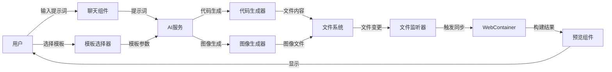
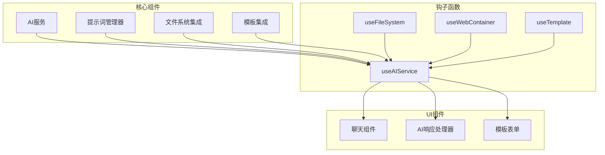
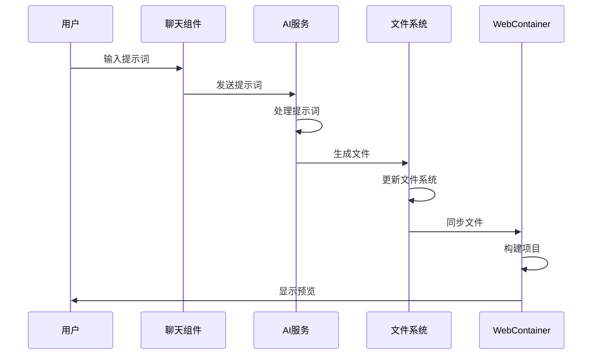

# AI LLM 功能使用指南

## 1. 功能概述

AI LLM 功能是一个集成了人工智能大语言模型的代码和图像生成系统，可以根据用户的需求自动生成代码和图像，并将其同步到文件系统和 WebContainer 中进行预览。



## 2. 主要功能

### 2.1 代码生成

通过 AI 大语言模型，根据用户的描述自动生成代码文件。支持多种编程语言和框架，可以生成完整的项目结构。

**使用方法**：
1. 在聊天框中输入代码需求描述
2. AI 会分析需求并生成相应的代码文件
3. 生成的文件会自动添加到文件系统中
4. 可以在编辑器中查看和编辑生成的代码
5. 使用 WebContainer 预览生成的代码效果

**示例提示词**：
```
创建一个简单的 React 组件，显示一个计数器，包含增加和减少按钮，使用 Tailwind CSS 样式。
```

### 2.2 图像生成

通过 AI 图像生成模型，根据用户的描述自动生成图像文件。支持多种风格和内容类型。

**使用方法**：
1. 在聊天框中输入图像需求描述
2. AI 会分析需求并生成相应的图像
3. 生成的图像会自动添加到文件系统中
4. 可以在文件浏览器中查看生成的图像
5. 生成的图像可以在 WebContainer 中预览

**示例提示词**：
```
生成一张现代风格的网站 hero 图像，展示一个智能手机应用界面，使用蓝色和紫色渐变背景。
```

### 2.3 模板处理

通过预定义的模板和用户提供的参数，快速生成完整的项目结构。

**使用方法**：
1. 在模板选择器中选择合适的模板
2. 填写模板所需的参数
3. AI 会根据模板和参数生成完整的项目文件
4. 生成的文件会自动添加到文件系统中
5. 使用 WebContainer 预览生成的项目

**支持的模板类型**：
- 落地页模板
- 博客模板
- 电商模板
- 餐厅模板
- 房地产模板

## 3. 技术实现

### 3.1 核心组件



### 3.2 文件结构

```
src/
├── core/
│   ├── ai/
│   │   ├── hooks/
│   │   │   └── useAIService.ts     # AI服务钩子
│   │   ├── integration/
│   │   │   ├── fileSystemIntegration.ts  # 文件系统集成
│   │   │   └── templateIntegration.ts    # 模板集成
│   │   ├── prompts/
│   │   │   └── promptManager.ts    # 提示词管理器
│   │   ├── service.ts              # AI服务实现
│   │   └── types.ts                # AI相关类型定义
│   ├── fileSystem/                 # 文件系统相关
│   └── webContainer/               # WebContainer相关
├── components/
│   ├── Chat/
│   │   ├── AIResponseHandler.tsx   # AI响应处理组件
│   │   ├── index.tsx               # 聊天组件
│   │   ├── InputArea.tsx           # 输入区域组件
│   │   ├── MessageList.tsx         # 消息列表组件
│   │   └── types.ts                # 聊天相关类型定义
│   └── TemplateForm/               # 模板表单组件
└── template/                       # 模板相关
```

### 3.3 数据流



## 4. 配置与自定义

### 4.1 API 配置

AI LLM 功能需要配置 API 密钥才能正常使用。可以在环境变量或配置文件中设置以下参数：

```typescript
{
  "apiKey": "your-api-key",
  "baseUrl": "https://api.openai.com",
  "modelName": "gpt-4",
  "timeout": 30000
}
```

### 4.2 提示词模板

可以自定义提示词模板，以便更好地控制 AI 生成的内容。提示词模板定义在 `src/core/ai/prompts/promptManager.ts` 文件中：

```typescript
const DEFAULT_TEMPLATES: PromptTemplate[] = [
  {
    id: 'code-generation',
    name: '代码生成',
    template: '请根据以下需求生成代码：\n\n{{requirement}}\n\n技术栈：{{stack}}',
    variables: ['requirement', 'stack'],
    description: '根据需求和技术栈生成代码',
    category: 'development',
    modelType: 'code'
  },
  // 更多模板...
];
```

### 4.3 模板自定义

可以自定义项目模板，以便快速生成特定类型的项目。模板定义在 `src/template/templateInfo.ts` 文件中：

```typescript
export const TEMPLATES: Template[] = [
  {
    id: "landing-page",
    name: "落地页模板",
    description: "适用于产品落地页",
    icon: "🚀",
    fields: [
      { id: "title", name: "标题", type: "text" },
      { id: "description", name: "描述", type: "textarea" },
      // 更多字段...
    ]
  },
  // 更多模板...
];
```

## 5. 常见问题

### 5.1 API 错误

**问题**：使用 AI 功能时出现 API 错误。

**解决方案**：
- 检查 API 密钥是否正确
- 确认 API 服务是否可用
- 检查网络连接是否正常
- 查看控制台错误日志获取详细信息

### 5.2 生成内容质量

**问题**：AI 生成的内容质量不符合预期。

**解决方案**：
- 提供更详细、更具体的提示词
- 使用提示词优化功能改进提示词
- 尝试不同的模板或参数
- 手动编辑生成的内容进行调整

### 5.3 文件同步问题

**问题**：生成的文件没有正确同步到 WebContainer。

**解决方案**：
- 检查文件系统状态
- 手动触发 WebContainer 同步
- 查看控制台错误日志
- 重新启动 WebContainer

## 6. 最佳实践

### 6.1 提示词编写

编写高质量提示词的技巧：
- 明确指定需求和期望的输出
- 提供具体的技术栈和框架信息
- 描述组件的功能和交互方式
- 指定样式和设计偏好
- 提供示例或参考

### 6.2 模板使用

有效使用模板的建议：
- 选择最接近需求的模板
- 提供详细的模板参数
- 生成后检查并调整文件
- 使用模板作为起点，而不是最终解决方案

### 6.3 工作流程

推荐的工作流程：
1. 选择合适的模板或编写详细的提示词
2. 生成初始代码和图像
3. 在编辑器中检查和调整生成的内容
4. 使用 WebContainer 预览效果
5. 根据需要进行迭代和改进
