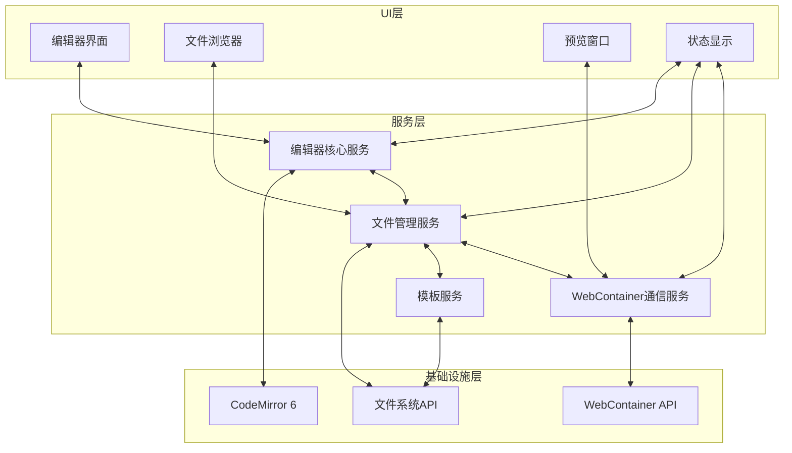
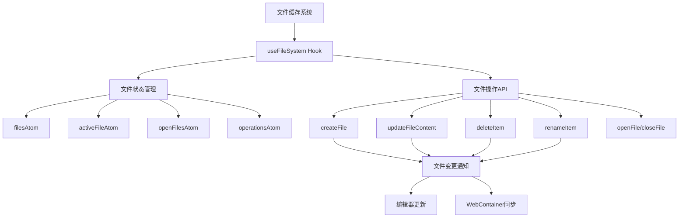
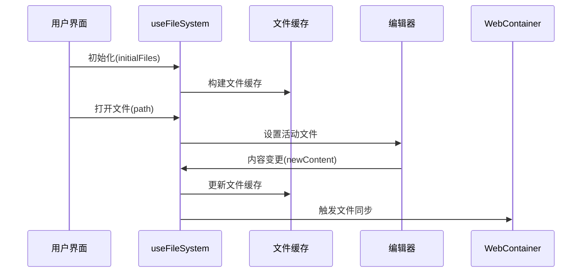
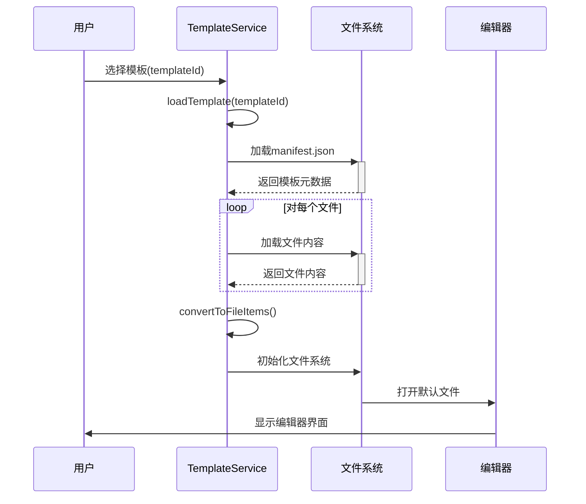
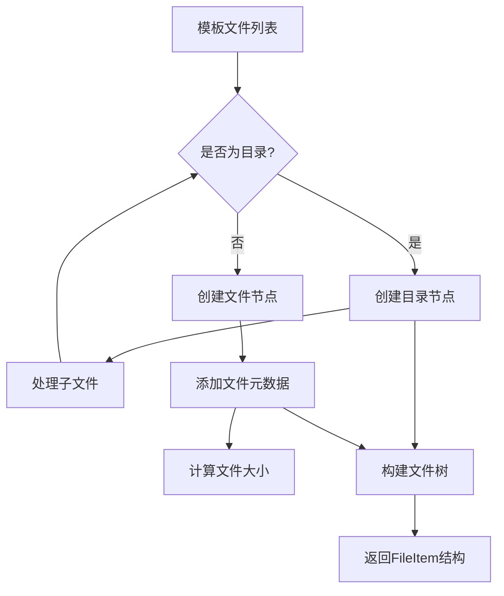
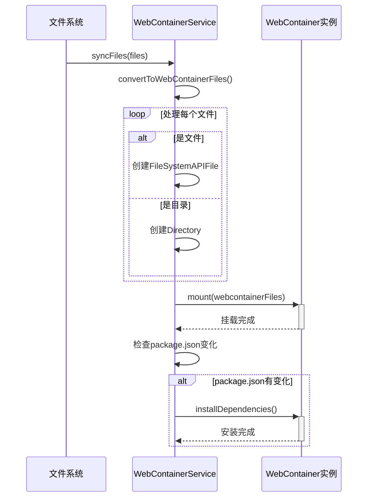
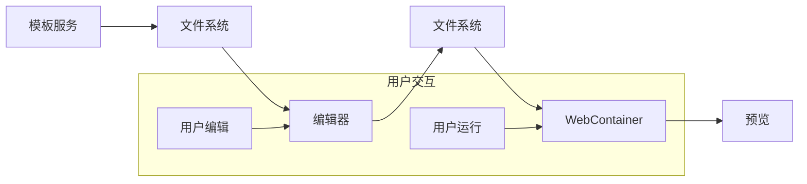
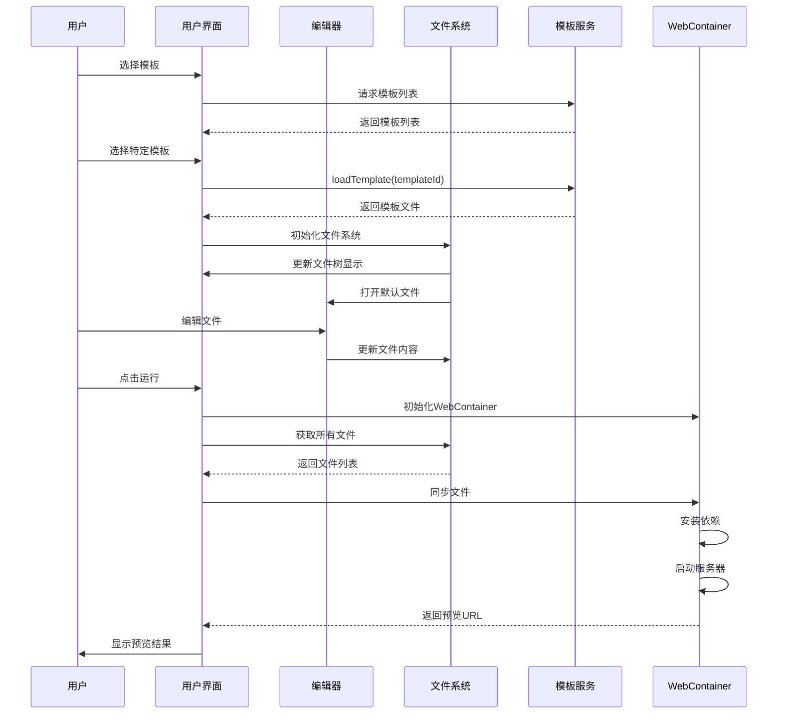

# CodeMirror 在线编辑器技术文档

## 1. 概述

本文档详细说明了基于 CodeMirror 6 的在线编辑器实现，包括与文件系统的集成、模板加载机制以及 WebContainer 的应用。该编辑器支持多种编程语言的语法高亮、代码补全、文件管理等功能，并能够实时预览运行结果。

## 2. 系统架构

### 2.1 整体架构图



### 2.2 组件层次

系统采用分层架构设计，将核心逻辑与 UI 分离，通过服务层与各组件交互：

- **UI 层**：编辑器界面、文件浏览器、状态显示等
- **服务层**：编辑器核心服务、文件管理服务、WebContainer 通信服务
- **基础设施层**：CodeMirror 6、WebContainer API、文件系统 API

### 2.3 核心组件

1. **编辑器组件**：基于 CodeMirror 6 实现的代码编辑器
2. **文件系统**：管理文件的创建、读取、更新和删除
3. **模板服务**：加载和管理项目模板
4. **WebContainer**：提供代码运行环境

### 2.4 数据流


## 3. CodeMirror 编辑器实现

### 3.1 编辑器核心 (useEditor Hook)

`useEditor` Hook 是编辑器的核心，负责创建和管理 CodeMirror 实例：

```typescript
export const useEditor = (options: EditorOptions = {}) => {
  const { initialDoc, extensions = [], onChange, readonly = false, language = "javascript" } = options;

  // 获取主题扩展
  const themeExtension = useAtomValue(themeExtensionAtom);

  // 编辑器引用
  const editorViewRef = useRef<EditorView | null>(null);
  const editorContainerRef = useRef<HTMLDivElement | null>(null);

  // 内容引用
  const contentRef = useRef<string>(initialDoc);
  const onChangeRef = useRef(onChange);

  // 返回编辑器API
  return {
    editorContainerRef,
    editorViewRef,
    setContent,
    updateContent,
    getContent,
    focus,
    refresh,
    undo,
    redo,
    // 其他方法...
  };
};
```

### 3.2 编辑器扩展

编辑器集成了多种 CodeMirror 扩展，提供丰富的编辑功能：

```typescript
// 基础扩展
const baseExtensions: Extension[] = useMemo(() => {
  return [
    lineNumbers(),
    highlightActiveLine(),
    history(),
    bracketMatching(),
    indentOnInput(),
    drawSelection(),
    rectangularSelection(),
    crosshairCursor(),
    search({
      top: true,
    }),
    foldGutter(),
    keymap.of([...defaultKeymap, ...historyKeymap, ...searchKeymap, ...foldKeymap, ...completionKeymap, indentWithTab]),
    getLanguageExtension,
    autoParams,
    themeExtension,
    EditorView.updateListener.of((update) => {
      if (update.docChanged) {
        const newContent = update.state.doc.toString();
        contentRef.current = newContent;
        if (onChangeRef.current) {
          onChangeRef.current(newContent);
        }
      }
    }),
  ];
}, [getLanguageExtension, themeExtension, autoParams]);
```

### 3.3 语言支持

编辑器支持多种编程语言，通过动态加载相应的语言扩展：

```typescript
// 获取语言扩展
const getLanguageExtension = useMemo(() => {
  switch (language) {
    case "javascript":
      return javascript();
    case "typescript":
      return javascript({ typescript: true });
    case "html":
      return html();
    case "css":
      return css();
    case "json":
      return json();
    default:
      return javascript();
  }
}, [language]);
```

### 3.4 主题系统

编辑器支持多种主题，包括亮色、暗色和系统主题：

```typescript
export function getThemeExtension(theme: EditorTheme): Extension {
  switch (theme) {
    case "dark":
      return darkThemeExtension;
    case "light":
      return lightThemeExtension;
    case "system":
      // 使用系统偏好
      if (window.matchMedia && window.matchMedia("(prefers-color-scheme: dark)").matches) {
        return darkThemeExtension;
      } else {
        return lightThemeExtension;
      }
    case "base":
    default:
      return [editorTheme, syntaxHighlighting(defaultHighlightStyle)];
  }
}
```

## 4. 文件系统实现

### 4.1 文件系统架构



### 4.2 文件系统核心钩子流程



### 4.3 文件系统核心 (useFileSystem Hook)

`useFileSystem` Hook 管理文件的创建、读取、更新和删除：

```typescript
export const useFileSystem = function (initialFiles?: FileItem[]) {
  // 状态管理
  const [files, setFiles] = useAtom(filesAtom);
  const [operations, setOperations] = useAtom(operationsAtom);
  const [activeFile, setActiveFile] = useAtom(activeFileAtom);
  const [openFiles, setOpenFiles] = useAtom(openFilesAtom);
  const activeFileContent = useAtomValue(activeFileContentAtom);

  // 返回文件系统API
  return {
    files,
    operations,
    activeFile,
    openFiles,
    findItem,
    createFile,
    createFolder,
    openFile,
    closeFile,
    renameItem,
    deleteItem,
    updateFileContent,
    activeFileContent,
    setActiveTab,
    resetFileSystem,
    // 其他方法...
  };
};
```

### 4.4 文件操作

文件系统提供了完整的文件操作 API：

#### 创建文件

```typescript
const createFile = useCallback(
  (parentPath: string, newFile?: FileItem) => {
    if (!newFile) return;

    // 检查文件是否已存在
    if (findItem(files, newFile.path)) {
      alert(`文件 ${newFile.name} 已存在!`);
      return;
    }

    // 添加创建时间和更新时间元数据
    const now = Date.now();
    const fileWithMetadata = {
      ...newFile,
      metadata: {
        ...(newFile.metadata || {}),
        createdAt: now,
        updatedAt: now,
        size: newFile.content ? new Blob([newFile.content]).size : 0,
      },
    };

    // 更新文件系统状态
    // ...
  },
  [
    /* 依赖项 */
  ]
);
```

#### 更新文件内容

```typescript
const updateFileContent = useCallback(
  (path: string, content: string) => {
    const now = Date.now();

    setFiles((prevFiles) =>
      findAndUpdateItem(prevFiles, path, (item) => {
        // 计算新的文件大小
        const size = new Blob([content]).size;

        return {
          ...item,
          content,
          metadata: {
            ...(item.metadata || { createdAt: now }),
            updatedAt: now,
            size,
          },
        };
      })
    );

    setOperations((prev) => [
      ...prev,
      {
        type: "update",
        path,
        timestamp: now,
      },
    ]);
  },
  [findAndUpdateItem, setFiles, setOperations]
);
```

### 4.5 文件缓存

为提高性能，文件系统实现了路径缓存机制：

```typescript
// 添加文件路径缓存，避免频繁遍历文件树
const pathToItemCacheRef = useRef<Map<string, FileItem>>(new Map());

// 更新文件缓存
const updateFileCache = useCallback((items: FileItem[]) => {
  // 清空现有缓存
  pathToItemCacheRef.current.clear();

  // 递归函数，将所有文件项添加到缓存
  const addToCache = (items: FileItem[]) => {
    for (const item of items) {
      pathToItemCacheRef.current.set(item.path, item);
      if (item.type === FileItemType.FOLDER && item.children) {
        addToCache(item.children);
      }
    }
  };

  addToCache(items);
}, []);
```

## 5. 模板系统实现

### 5.1 模板加载流程



### 5.2 模板文件结构转换流程



### 5.3 模板服务 (TemplateService)

`TemplateService` 负责加载和管理项目模板：

```typescript
export class TemplateService {
  private baseUrl: string;

  constructor(baseUrl: string = "/templates") {
    this.baseUrl = baseUrl;
  }

  /**
   * 获取模板列表
   */
  async getTemplates(): Promise<Template[]> {
    // ...
  }

  /**
   * 加载模板内容
   */
  async loadTemplate(templateId: string): Promise<TemplateLoadResult> {
    try {
      // 加载manifest.json文件
      const manifestResponse = await fetch(`${this.baseUrl}/${templateId}/manifest.json`);
      // ...

      // 加载所有文件内容
      const filePromises: Promise<{ path: string; content: string }>[] = [];
      // ...

      // 转换为FileItem格式
      const files = this.convertToFileItems(fileContents);

      return {
        success: true,
        files,
      };
    } catch (error) {
      // ...
    }
  }

  /**
   * 将文件内容转换为FileItem格式
   */
  private convertToFileItems(files: { path: string; content: string }[]): FileItem[] {
    // ...
  }
}
```

### 5.4 模板钩子 (useTemplate Hook)

`useTemplate` Hook 提供了模板管理的状态和方法：

```typescript
export const useTemplate = (templateService: TemplateService) => {
  const [templates, setTemplates] = useState<Template[]>([]);
  const [loading, setLoading] = useState<boolean>(false);
  const [error, setError] = useState<string | null>(null);
  const [selectedTemplate, setSelectedTemplate] = useState<string | null>(null);

  // 加载模板列表
  useEffect(() => {
    const loadTemplates = async () => {
      // ...
    };

    loadTemplates();
  }, [templateService]);

  // 加载模板内容
  const loadTemplateContent = useCallback(
    async (templateId: string): Promise<TemplateLoadResult> => {
      // ...
    },
    [templateService]
  );

  // 选择模板
  const selectTemplate = useCallback((templateId: string) => {
    setSelectedTemplate(templateId);
  }, []);

  return {
    templates,
    selectedTemplate,
    loading,
    error,
    loadTemplateContent,
    selectTemplate,
  };
};
```

## 6. 编辑器与文件系统集成

### 6.1 编辑器组件 (Editor)

`Editor` 组件将 CodeMirror 编辑器与文件系统集成：

```typescript
export const Editor = ({ initialCode, onChange, readonly = false }: EditorProps) => {
  // 处理编辑器内容变化
  const handleEditorChange = useCallback(
    (newContent: string) => {
      // 只调用外部的onChange，不直接更新文件系统
      if (onChange) {
        onChange(newContent);
      }
    },
    [onChange]
  );

  // 使用编辑器Hook
  const { editorContainerRef, updateContent, getContent } = useEditor({
    initialDoc: initialCode || "",
    onChange: handleEditorChange,
    readonly,
  });

  // 切换文件时更新编辑器内容
  useEffect(() => {
    if (initialCode !== undefined && getContent && updateContent) {
      const currentContent = getContent();
      if (initialCode !== currentContent) {
        updateContent(initialCode);
      }
    }
  }, [initialCode, updateContent, getContent]);

  return (
    <div className="editor-container">
      <div className="editor-wrapper" ref={editorContainerRef}></div>
    </div>
  );
};
```

### 6.2 应用集成 (App)

在应用主组件中，编辑器、文件系统和模板服务被集成在一起：

```typescript
// 使用文件系统钩子
const { updateFileContent, activeFileContent, activeFile, openFile, files, findItem, openFiles, setActiveTab, resetFileSystem, findFirstFile } =
  useFileSystem();

// 使用WebContainer钩子
const { previewUrl, error: webContainerError, startApp } = useWebContainer();

// 处理代码变更（使用防抖优化）
const handleCodeChange = useMemoizedFn((newCode: string) => {
  debouncedUpdateRef.current(newCode, activeFile);
});

// 创建防抖更新函数
const debouncedUpdateRef = useRef(
  debounce((newCode: string, file: string | null) => {
    if (file) {
      updateFileContent(file, newCode);
    }
  }, 1000)
);
```

## 7. WebContainer 集成

### 7.1 WebContainer 构建流程

```mermaid
flowchart TD
    A[初始化WebContainer] --> B[WebContainer.boot()]
    B --> C[创建ServerManager]
    C --> D[同步文件系统]

    D --> E{是否有package.json?}
    E -->|是| F[安装依赖]
    E -->|否| G[跳过依赖安装]

    F & G --> H[检测启动脚本]
    H --> I[启动开发服务器]
    I --> J[获取预览URL]
    J --> K[返回预览界面]
```

### 7.2 文件系统同步流程



### 7.3 WebContainer 服务

`WebContainerService` 负责管理 WebContainer 实例，提供文件同步、依赖安装和服务启动等功能：

```typescript
public async initialize(): Promise<boolean> {
  try {
    if (this.webcontainerInstance) {
      return true;
    }

    // 初始化WebContainer实例
    this.webcontainerInstance = await WebContainer.boot();
    this.isRunning = true;
    this.error = null;

    // 初始化服务器管理器
    this.serverManager = new ServerManager(this.webcontainerInstance);
    // ...

    return true;
  } catch (err) {
    // ...
    return false;
  }
}

public async syncFiles(files: FileItem[]): Promise<void> {
  if (!this.webcontainerInstance) {
    throw new Error("WebContainer未初始化");
  }

  try {
    // 将FileItem格式转换为WebContainer所需的格式
    const webcontainerFiles = this.convertToWebContainerFiles(files);

    // 查找package.json并计算哈希
    // ...

    // 将文件写入WebContainer
    await this.webcontainerInstance.mount(webcontainerFiles);

    // 通知终端输出监听器
    this.notifyTerminalOutput("文件同步完成");
  } catch (err) {
    // ...
  }
}
```

### 7.4 WebContainer 钩子 (useWebContainer Hook)

`useWebContainer` Hook 提供了 WebContainer 的状态和方法：

```typescript
const startApp = useCallback(
  async (files: FileItem[]) => {
    try {
      // 清空之前的错误信息
      setError(null);

      // 重置预览URL
      setPreviewUrl("");

      // 1. 初始化WebContainer（如果尚未初始化）
      if (status !== WebContainerStatus.RUNNING) {
        const initSuccess = await initialize();
        if (!initSuccess) {
          throw new Error("初始化WebContainer失败");
        }
      }

      // 2. 同步文件
      const syncSuccess = await syncFiles(files);
      if (!syncSuccess) {
        throw new Error("同步文件失败");
      }

      // 3. 安装依赖
      if (!serviceRef.current) {
        throw new Error("WebContainer服务未初始化");
      }

      try {
        await serviceRef.current.installDependencies();
      } catch (err) {
        // 依赖安装失败不一定是致命错误，可以继续尝试启动服务器
      }

      // 4. 启动开发服务器
      const serverUrl = await serviceRef.current.startDevServer();
      if (serverUrl) {
        setPreviewUrl(serverUrl);
        setStatus(WebContainerStatus.RUNNING);
        setIsTerminalExpanded(true);
      } else {
        throw new Error("无法获取WebContainer内部服务URL");
      }

      return true;
    } catch (err) {
      // ...
      return false;
    }
  },
  [
    /* 依赖项 */
  ]
);
```

## 8. 完整工作流程

### 8.1 模板加载到文件编辑的完整流程

1. **模板选择与加载**

   - 用户从模板库中选择一个模板
   - 系统加载模板的 manifest.json 文件
   - 根据 manifest 加载所有模板文件
   - 将文件转换为 FileItem 格式

2. **文件系统初始化**

   - 使用模板文件初始化文件系统
   - 为文件添加元数据（创建时间、大小等）
   - 更新文件缓存

3. **编辑器渲染**

   - 打开默认文件
   - 编辑器根据文件类型加载相应的语言扩展
   - 渲染文件内容

4. **文件编辑**

   - 用户编辑文件内容
   - 编辑器触发 onChange 事件
   - 使用防抖函数更新文件系统中的文件内容

5. **WebContainer 同步与预览**
   - 用户点击"运行"按钮
   - 系统将文件同步到 WebContainer
   - 安装依赖并启动开发服务器
   - 在预览区域显示运行结果

### 8.2 关键数据流



## 9. 技术栈与依赖

### 9.1 核心依赖

- **CodeMirror 6**：提供编辑器核心功能

  - @codemirror/state
  - @codemirror/view
  - @codemirror/language
  - @codemirror/commands
  - 各种语言扩展（javascript、html、css 等）

- **WebContainer API**：提供代码运行环境

  - @webcontainer/api

- **状态管理**：

  - jotai：轻量级状态管理库

- **UI 框架**：
  - React
  - Tailwind CSS
  - Framer Motion（动画）

## 10. 系统交互流程



## 11. 总结

本项目实现了一个功能完善的在线代码编辑器，通过 CodeMirror 6 提供强大的编辑功能，结合自定义文件系统和模板服务，实现了从模板加载到代码编辑再到预览运行的完整工作流程。系统采用模块化设计，各组件之间通过明确的接口进行交互，具有良好的可扩展性和可维护性。

通过 WebContainer 技术，系统能够在浏览器中直接运行代码，无需后端服务器支持，为用户提供了便捷的开发体验。同时，系统还支持主题切换、多语言支持等功能，满足不同用户的需求。
