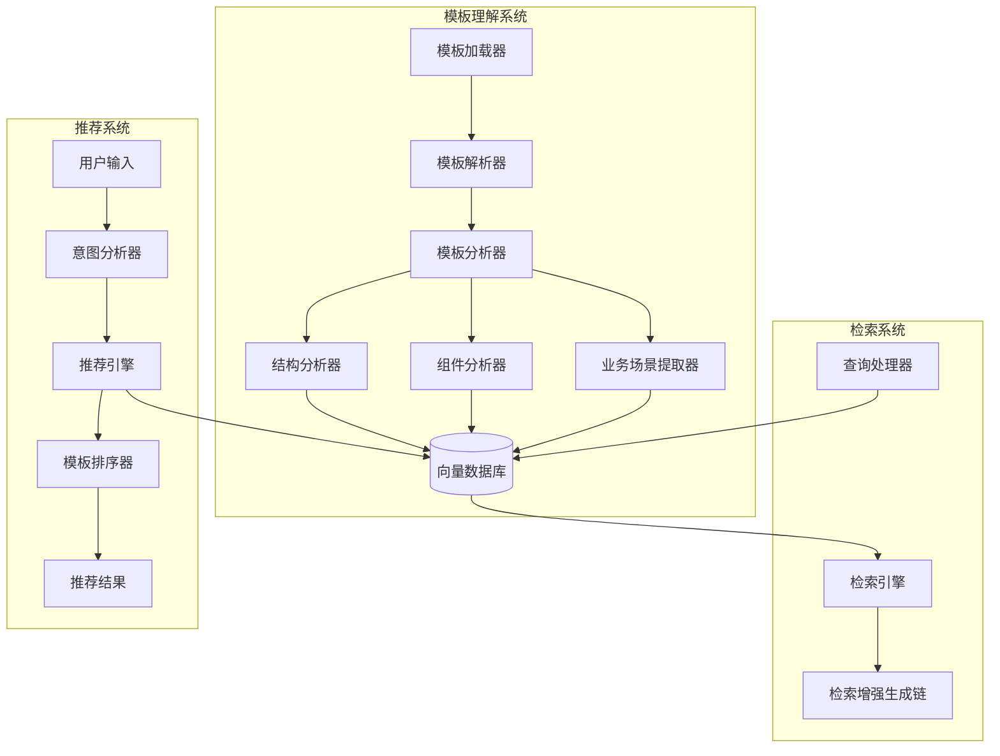
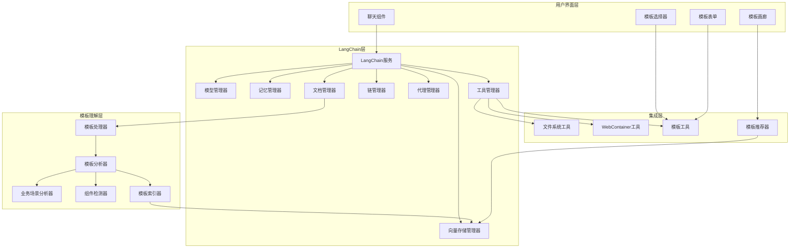
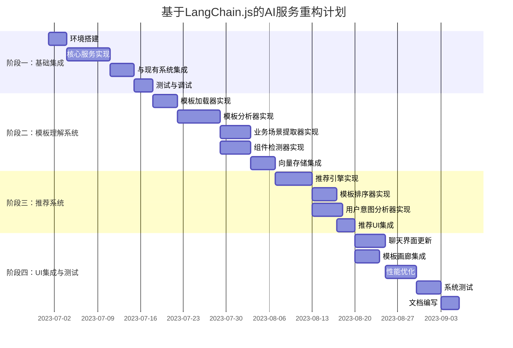

# LangChain.js 集成技术方案

## 1. 背景与需求分析

### 1.1 当前系统状况

目前的 AI 聊天功能实现了基础的功能，包括：

- 与不同 AI 厂商的 API 对接（OpenAI、Google Gemini、DeepSeek 等）
- 基础的聊天界面和交互
- 代码生成和图像生成能力
- 与文件系统和 WebContainer 的集成
- 模板选择和处理功能

### 1.2 现有系统的局限性

通过分析现有代码，发现以下局限性：

1. **模板理解能力不足**：无法深入理解模板内容、业务场景和组件关系
2. **模板推荐能力缺失**：无法基于用户需求智能推荐合适的模板
3. **模板内容检索能力弱**：无法精确检索模板中的业务组件和功能
4. **缺乏上下文管理**：当前聊天实现没有保持对话上下文的机制，每次请求都是独立的
5. **厂商集成方式简单**：对不同 AI 厂商的集成是通过简单的 API 调用实现，缺乏统一的抽象层
6. **无记忆功能**：无法在多轮对话中保持记忆或引用之前的内容
7. **文件操作能力有限**：虽然可以生成文件，但缺乏精确修改现有文件的能力
8. **聊天历史管理简单**：聊天历史仅在前端状态中保存，没有持久化

### 1.3 LangChain.js 能解决的问题

LangChain.js 作为一个强大的框架，可以帮助解决上述问题：

- **模板理解与分析**：能够深入理解模板的业务场景、组件功能和适用条件
- **智能模板推荐**：基于用户需求智能推荐最合适的模板和组件
- **组件功能识别**：能够识别和解释模板中各组件的功能和用途
- **业务场景匹配**：能够将用户需求与适合的业务场景和模板进行匹配
- **文档加载与处理**：支持加载和处理各种格式的文档，包括模板文件和代码文件
- **向量存储与检索**：支持将模板内容转换为向量并进行语义检索
- **检索增强生成(RAG)**：结合检索和生成能力，提供基于模板知识库的回答
- **上下文管理**：提供完善的上下文管理机制，支持长对话和上下文窗口管理
- **多厂商统一接口**：提供统一的抽象层，简化多厂商集成
- **记忆系统**：内置多种记忆类型，支持短期和长期记忆
- **工具集成**：支持与文件系统、数据库等工具的集成
- **链式处理**：支持构建复杂的处理链，实现更复杂的 AI 应用逻辑
- **结构化输出**：支持生成结构化的输出，便于解析和处理模板信息

## 2. 基于 LangChain.js 的 AI 服务重构方案

### 2.1 重构目标

基于 LangChain.js 重构整个 AI 服务，实现以下核心目标：

1. **多模板理解与分析**：能够读取、理解和分析多个页面模板的内容、结构和功能
2. **业务场景识别**：能够识别不同模板适用的业务场景和行业特点
3. **组件功能识别**：能够识别模板中包含的业务组件及其功能
4. **智能推荐系统**：基于用户需求智能推荐最合适的模板和组件
5. **上下文感知对话**：实现具有记忆功能的上下文感知对话
6. **多模型统一接口**：提供统一的抽象层，简化多厂商 AI 模型的集成
7. **文件系统深度集成**：实现更精细的文件操作和代码生成能力

### 2.2 模板理解与分析架构



### 2.3 模板理解流程

1. **模板加载**：从文件系统加载所有可用的模板文件
2. **模板解析**：解析模板的 HTML、CSS 和 JavaScript 代码
3. **结构分析**：分析模板的 DOM 结构、样式和交互逻辑
4. **组件识别**：识别模板中的 UI 组件和业务组件
5. **业务场景提取**：提取模板适用的业务场景和行业特点
6. **向量化存储**：将分析结果转换为向量并存储在向量数据库中
7. **索引建立**：建立检索索引，支持语义搜索和相似度匹配

### 2.4 业务场景识别能力

系统将能够识别模板适用的业务场景，包括但不限于：

- **行业类型**：金融、教育、电商、医疗、科技等
- **业务目标**：营销、转化、信息展示、用户注册等
- **目标受众**：企业客户、个人用户、特定年龄段用户等
- **交互模式**：信息浏览、表单提交、产品展示、服务咨询等
- **设计风格**：简约、现代、传统、创意、专业等

### 2.5 组件功能识别能力

系统将能够识别模板中的组件及其功能，包括：

- **UI 组件**：导航栏、轮播图、表单、按钮、卡片等
- **业务组件**：产品展示、价格表、联系表单、注册流程等
- **功能组件**：支付集成、社交分享、数据可视化、用户认证等
- **交互组件**：弹窗、下拉菜单、标签页、手风琴等
- **自定义组件**：特定业务逻辑的自定义组件

## 3. 基于 LangChain.js 的 AI 服务架构

### 3.1 整体架构

基于 LangChain.js 重构的 AI 服务架构如下：



### 3.2 LangChain.js 核心概念应用

重构中将应用 LangChain.js 的以下核心概念：

1. **模型 (Models)**：对各种 LLM 和嵌入模型的抽象，统一集成 OpenAI、Google Gemini、DeepSeek 等模型
2. **提示词 (Prompts)**：使用提示词模板和提示词工程技术来实现模板理解和分析
3. **链 (Chains)**：构建复杂的处理链，如模板分析链、推荐链、检索增强生成链
4. **记忆 (Memory)**：实现对话记忆和上下文管理，支持多轮对话中的上下文理解
5. **工具 (Tools)**：集成文件系统、WebContainer 和模板处理工具
6. **代理 (Agents)**：实现智能代理，可以自主决策使用哪些工具来完成用户请求
7. **向量存储 (VectorStore)**：存储和检索模板的向量表示，支持语义搜索
8. **文档加载器 (DocumentLoaders)**：加载和处理模板文件和代码

### 3.3 与现有系统的集成点

LangChain.js 与现有系统的集成点包括：

1. **模型集成**：无缝集成现有的 AI 模型调用，如 OpenAI、Google Gemini、DeepSeek 等
2. **提示词管理**：增强现有的提示词管理系统，支持更复杂的提示词模板
3. **文件系统集成**：增强与文件系统的交互能力，支持更精细的文件操作
4. **WebContainer 集成**：将 WebContainer 作为工具集成到 LangChain 中，增强预览能力
5. **UI 组件复用**：保留现有 UI 组件，仅替换底层逻辑
6. **模板系统集成**：增强对模板系统的理解和处理能力

### 3.4 核心组件设计

#### 3.4.1 LangChain 服务

```typescript
interface LangChainServiceConfig {
  defaultModelName: string;
  memoryType: "buffer" | "summary" | "conversation" | "vector";
  persistenceProvider?: "localStorage" | "indexedDB" | "custom";
  maxTokens?: number;
  temperature?: number;
}

interface LangChainService {
  initialize(config: LangChainServiceConfig): Promise<boolean>;
  createConversation(conversationId: string, options?: any): Promise<Conversation>;
  getConversation(conversationId: string): Conversation | null;
  listConversations(): Promise<ConversationInfo[]>;
  deleteConversation(conversationId: string): Promise<boolean>;
  executeAgentAction(conversationId: string, input: string): Promise<AgentResponse>;
  analyzeTemplate(templatePath: string): Promise<TemplateAnalysisResult>;
  recommendTemplates(userQuery: string): Promise<TemplateRecommendation[]>;
  identifyBusinessContext(templateContent: string): Promise<BusinessContext>;
  detectComponents(templateContent: string): Promise<ComponentInfo[]>;
}
```

#### 3.4.2 模板分析器

```typescript
interface TemplateAnalysisConfig {
  analyzeComponents: boolean;
  analyzeBusinessContext: boolean;
  analyzeStructure: boolean;
  extractMetadata: boolean;
  vectorizeContent: boolean;
}

interface TemplateAnalyzer {
  initialize(config?: TemplateAnalysisConfig): Promise<boolean>;
  analyzeTemplate(templatePath: string): Promise<TemplateAnalysisResult>;
  analyzeComponent(componentCode: string): Promise<ComponentInfo>;
  extractBusinessContext(templateContent: string): Promise<BusinessContext>;
  identifyTemplateType(templateContent: string): Promise<TemplateType>;
  vectorizeTemplate(templatePath: string): Promise<boolean>;
}

interface TemplateAnalysisResult {
  templateId: string;
  templatePath: string;
  businessContext: BusinessContext;
  components: ComponentInfo[];
  structure: TemplateStructure;
  metadata: Record<string, any>;
  similarTemplates?: string[];
}
```

#### 3.4.3 模板推荐器

```typescript
interface TemplateRecommenderConfig {
  maxResults: number;
  similarityThreshold: number;
  includeComponents: boolean;
  rankingStrategy: "similarity" | "popularity" | "hybrid";
}

interface TemplateRecommender {
  initialize(config?: TemplateRecommenderConfig): Promise<boolean>;
  recommendTemplates(userQuery: string): Promise<TemplateRecommendation[]>;
  findSimilarTemplates(templateId: string): Promise<TemplateRecommendation[]>;
  recommendComponentsForTemplate(templateId: string): Promise<ComponentRecommendation[]>;
  rankTemplates(templates: TemplateInfo[], userQuery: string): Promise<TemplateRecommendation[]>;
}

interface TemplateRecommendation {
  templateId: string;
  templatePath: string;
  templateName: string;
  description: string;
  matchScore: number;
  businessContextMatch: BusinessContextMatch;
  previewUrl?: string;
  recommendedComponents?: ComponentRecommendation[];
}
```

#### 3.4.4 文件系统工具

```typescript
interface FileSystemToolsConfig {
  enabledTools: string[];
  maxFileSize?: number;
  allowedExtensions?: string[];
}

const fileSystemTools = [
  {
    name: "readFile",
    description: "读取文件内容",
    schema: {
      type: "object",
      properties: {
        path: {
          type: "string",
          description: "文件路径",
        },
      },
      required: ["path"],
    },
    handler: async ({ path }) => {
      // 使用现有的fileSystem.readFile实现
    },
  },
  {
    name: "writeFile",
    description: "写入文件内容",
    schema: {
      type: "object",
      properties: {
        path: {
          type: "string",
          description: "文件路径",
        },
        content: {
          type: "string",
          description: "文件内容",
        },
      },
      required: ["path", "content"],
    },
    handler: async ({ path, content }) => {
      // 使用现有的fileSystem.writeFile实现
    },
  },
  {
    name: "updateFile",
    description: "更新文件内容",
    schema: {
      type: "object",
      properties: {
        path: {
          type: "string",
          description: "文件路径",
        },
        content: {
          type: "string",
          description: "新的文件内容",
        },
        position: {
          type: "object",
          description: "更新位置",
          properties: {
            start: { type: "number" },
            end: { type: "number" },
          },
        },
      },
      required: ["path", "content"],
    },
    handler: async ({ path, content, position }) => {
      // 实现精确的文件内容更新
    },
  },
];
```

## 4. 重构实现计划

### 4.1 重构目标

基于 LangChain.js 重构整个 AI 服务，实现以下目标：

1. **模板理解与分析系统**：实现对多个页面模板的内容、业务场景和组件功能的深度理解
2. **智能模板推荐系统**：基于用户需求智能推荐最合适的模板和组件
3. **上下文感知对话系统**：实现具有记忆功能的多轮对话
4. **统一的 AI 模型集成**：提供统一的抽象层，简化多厂商 AI 模型的集成
5. **增强的文件操作能力**：实现更精细的文件操作和代码生成能力

### 4.2 实现阶段



### 4.3 阶段一：基础集成（2 周）

1. **环境搭建**

   - 安装 LangChain.js 及相关依赖
   - 配置开发环境
   - 集成向量存储库（如 ChromaDB 或 Pinecone）

2. **核心服务实现**

   - 实现 LangChainService 基础类
   - 实现 ModelManager 管理多模型集成
   - 实现 MemoryManager 管理对话记忆
   - 实现基础的对话功能

3. **与现有系统集成**
   - 将 LangChain 服务与现有 AI 服务集成
   - 更新 useAIService 钩子以支持 LangChain
   - 集成文件系统工具

### 4.4 阶段二：模板理解系统（2 周）

1. **模板加载器实现**

   - 实现模板文件加载功能
   - 支持不同类型模板的解析
   - 实现模板内容提取

2. **模板分析器实现**

   - 实现 HTML/CSS/JS 代码分析
   - 实现模板结构分析
   - 实现模板元数据提取

3. **业务场景提取器实现**

   - 实现业务场景识别
   - 实现行业类型分类
   - 实现目标受众分析

4. **组件检测器实现**

   - 实现 UI 组件识别
   - 实现业务组件识别
   - 实现组件功能分析

5. **向量存储集成**
   - 实现模板内容向量化
   - 实现向量索引建立
   - 实现语义搜索功能

### 4.5 阶段三：推荐系统（2 周）

1. **推荐引擎实现**

   - 实现基于向量相似度的推荐算法
   - 实现基于业务场景匹配的推荐
   - 实现基于用户历史的个性化推荐

2. **模板排序器实现**

   - 实现多维度模板评分
   - 实现动态排序策略
   - 实现用户反馈学习

3. **用户意图分析器实现**

   - 实现自然语言需求分析
   - 实现关键词提取和扩展
   - 实现需求与业务场景映射

4. **推荐 UI 集成**
   - 实现模板画廊推荐界面
   - 实现相似模板展示
   - 实现组件推荐功能

### 4.6 阶段四：UI 集成与测试（2 周）

1. **聊天界面更新**

   - 实现上下文感知对话界面
   - 实现对话历史浏览器
   - 实现工具使用界面

2. **模板画廊集成**

   - 实现智能搜索功能
   - 实现模板推荐展示
   - 实现业务场景筛选

3. **性能优化**

   - 优化大型对话的性能
   - 实现流式响应
   - 优化向量检索性能

4. **系统测试**

   - 编写单元测试
   - 编写集成测试
   - 进行用户体验测试

5. **文档编写**

   - 编写开发文档
   - 编写用户指南
   - 编写 API 文档

## 5. 技术实现示例

### 5.1 LangChain 服务实现

```typescript
// src/core/ai/langchain/service.ts
import { ChatOpenAI } from "langchain/chat_models/openai";
import { BufferMemory } from "langchain/memory";
import { ConversationChain } from "langchain/chains";
import { AIServiceStatus } from "../types";
import { TemplateAnalyzer } from "./template/analyzer";
import { TemplateRecommender } from "./template/recommender";

export class LangChainService {
  private static instance: LangChainService;
  private status: AIServiceStatus = AIServiceStatus.UNINITIALIZED;
  private conversations: Map<string, ConversationChain> = new Map();
  private config: LangChainServiceConfig | null = null;
  private templateAnalyzer: TemplateAnalyzer;
  private templateRecommender: TemplateRecommender;

  private constructor() {
    this.templateAnalyzer = new TemplateAnalyzer();
    this.templateRecommender = new TemplateRecommender();
  }

  public static getInstance(): LangChainService {
    if (!LangChainService.instance) {
      LangChainService.instance = new LangChainService();
    }
    return LangChainService.instance;
  }

  public async initialize(config: LangChainServiceConfig): Promise<boolean> {
    try {
      this.status = AIServiceStatus.INITIALIZING;
      this.config = config;

      // 初始化模板分析器和推荐器
      await this.templateAnalyzer.initialize();
      await this.templateRecommender.initialize();

      // 初始化成功
      this.status = AIServiceStatus.READY;
      return true;
    } catch (error) {
      this.status = AIServiceStatus.ERROR;
      console.error("LangChain服务初始化失败:", error);
      return false;
    }
  }

  public async analyzeTemplate(templatePath: string): Promise<TemplateAnalysisResult> {
    return this.templateAnalyzer.analyzeTemplate(templatePath);
  }

  public async recommendTemplates(userQuery: string): Promise<TemplateRecommendation[]> {
    return this.templateRecommender.recommendTemplates(userQuery);
  }

  public async identifyBusinessContext(templateContent: string): Promise<BusinessContext> {
    return this.templateAnalyzer.extractBusinessContext(templateContent);
  }

  public async detectComponents(templateContent: string): Promise<ComponentInfo[]> {
    const result = await this.templateAnalyzer.analyzeComponent(templateContent);
    return result ? [result] : [];
  }
}
```

### 5.2 useAIService 钩子更新

```typescript
// src/core/ai/hooks/useAIService.ts
import { useState, useCallback, useRef, useEffect } from "react";
import { AIService } from "../service";
import { LangChainService } from "../langchain/service";
import { PromptManager } from "../prompts/promptManager";
import { AIServiceStatus, AIRequestOptions, AIResponse } from "../types";
import { useFileSystem } from "@/core/fileSystem";
import { useWebContainer } from "@/core/webContainer";

export const useAIService = (options: UseAIServiceOptions = {}) => {
  // 获取服务实例
  const aiService = useRef(AIService.getInstance());
  const langChainService = useRef(LangChainService.getInstance());
  const promptManager = useRef(PromptManager.getInstance());

  // 状态
  const [status, setStatus] = useState<AIServiceStatus>(AIServiceStatus.UNINITIALIZED);
  const [error, setError] = useState<string | null>(null);
  const [isProcessing, setIsProcessing] = useState(false);
  const [currentModelType, setCurrentModelType] = useState<AIModelType>(options.modelType || AIModelType.DEEPSEEK);
  const [currentConversationId, setCurrentConversationId] = useState<string>("default");
  const [conversations, setConversations] = useState<ConversationInfo[]>([]);
  const [templates, setTemplates] = useState<TemplateInfo[]>([]);
  const [recommendedTemplates, setRecommendedTemplates] = useState<TemplateRecommendation[]>([]);

  // 获取其他钩子
  const fileSystem = useFileSystem();
  const webContainer = useWebContainer();

  // 初始化服务
  const initialize = useCallback(
    async (apiKey?: string, baseUrl?: string, modelName?: string): Promise<boolean> => {
      try {
        setStatus(AIServiceStatus.INITIALIZING);

        // 获取当前模型配置
        const modelConfig = getCurrentModelConfig();

        // 初始化LangChain服务
        const lcSuccess = await langChainService.current.initialize({
          defaultModelName: modelName || currentModelType || options.modelName || "gpt-4o",
          memoryType: "buffer",
          persistenceProvider: "localStorage",
          maxTokens: options.maxTokens || 2000,
          temperature: options.temperature || 0.7,
        });

        if (!lcSuccess) {
          throw new Error("LangChain服务初始化失败");
        }

        // 创建默认对话
        await langChainService.current.createConversation("default");

        // 加载对话列表
        const convList = await langChainService.current.listConversations();
        setConversations(convList);

        // 加载模板列表
        await loadTemplates();

        setStatus(AIServiceStatus.READY);
        return true;
      } catch (err) {
        setStatus(AIServiceStatus.ERROR);
        const errorMessage = err instanceof Error ? err.message : "初始化失败";
        setError(errorMessage);
        return false;
      }
    },
    [currentModelType, options]
  );

  // 加载模板
  const loadTemplates = useCallback(async () => {
    try {
      // 从文件系统加载模板
      const templateFiles = await fileSystem.listFiles("/templates");
      const templateInfos: TemplateInfo[] = [];

      for (const file of templateFiles) {
        if (file.type === FileItemType.FOLDER) {
          // 分析模板
          const result = await langChainService.current.analyzeTemplate(file.path);
          if (result) {
            templateInfos.push({
              id: result.templateId,
              path: result.templatePath,
              name: file.name,
              businessContext: result.businessContext,
              components: result.components,
            });
          }
        }
      }

      setTemplates(templateInfos);
    } catch (error) {
      console.error("加载模板失败:", error);
    }
  }, [fileSystem]);

  // 推荐模板
  const recommendTemplates = useCallback(async (query: string): Promise<TemplateRecommendation[]> => {
    try {
      const recommendations = await langChainService.current.recommendTemplates(query);
      setRecommendedTemplates(recommendations);
      return recommendations;
    } catch (error) {
      console.error("模板推荐失败:", error);
      return [];
    }
  }, []);

  // 其他方法...

  return {
    // 状态
    status,
    error,
    isProcessing,
    currentModelType,
    currentConversationId,
    conversations,
    templates,
    recommendedTemplates,

    // 方法
    initialize,
    generateCode,
    generateImage,
    sendChatRequest,
    optimizePrompt,
    processTemplate,
    cancelRequest,
    reset,
    switchModel,
    getCurrentModelConfig,

    // LangChain特有方法
    createConversation,
    switchConversation,
    deleteConversation,
    loadTemplates,
    recommendTemplates,
    analyzeTemplate,
  };
};
```

### 5.3 模板分析器实现

```typescript
// src/core/ai/langchain/template/analyzer.ts
import { Document } from "langchain/document";
import { OpenAIEmbeddings } from "langchain/embeddings/openai";
import { ChatOpenAI } from "langchain/chat_models/openai";
import { PromptTemplate } from "langchain/prompts";
import { LLMChain } from "langchain/chains";
import { CheerioWebBaseLoader } from "langchain/document_loaders/web/cheerio";

export class TemplateAnalyzer {
  private model: ChatOpenAI;
  private embeddings: OpenAIEmbeddings;
  private businessContextChain: LLMChain;
  private componentAnalysisChain: LLMChain;

  constructor() {
    this.model = new ChatOpenAI({
      modelName: "gpt-4o",
      temperature: 0.2,
    });

    this.embeddings = new OpenAIEmbeddings();

    // 初始化业务场景分析链
    const businessContextPrompt = PromptTemplate.fromTemplate(
      `分析以下模板的HTML内容，提取其业务场景信息。
      请识别以下内容：
      1. 行业类型（如金融、教育、电商等）
      2. 业务目标（如营销、转化、信息展示等）
      3. 目标受众（如企业客户、个人用户等）
      4. 设计风格（如简约、现代、传统等）

      模板内容：{templateContent}

      请以JSON格式返回结果，包含上述各项内容。`
    );

    this.businessContextChain = new LLMChain({
      llm: this.model,
      prompt: businessContextPrompt,
    });

    // 初始化组件分析链
    const componentAnalysisPrompt = PromptTemplate.fromTemplate(
      `分析以下模板代码片段，识别其中的UI组件和业务组件。
      请识别以下内容：
      1. 组件类型（UI组件或业务组件）
      2. 组件名称
      3. 组件功能描述
      4. 主要属性和事件

      代码片段：{componentCode}

      请以JSON格式返回结果，包含上述各项内容。`
    );

    this.componentAnalysisChain = new LLMChain({
      llm: this.model,
      prompt: componentAnalysisPrompt,
    });
  }

  public async initialize(config?: TemplateAnalysisConfig): Promise<boolean> {
    try {
      // 初始化配置
      return true;
    } catch (error) {
      console.error("模板分析器初始化失败:", error);
      return false;
    }
  }

  public async analyzeTemplate(templatePath: string): Promise<TemplateAnalysisResult> {
    try {
      // 加载模板文件
      const loader = new CheerioWebBaseLoader(templatePath);
      const docs = await loader.load();
      const templateContent = docs[0].pageContent;

      // 提取模板 ID
      const templateId = `template_${Date.now()}`;

      // 分析业务场景
      const businessContext = await this.extractBusinessContext(templateContent);

      // 分析组件
      const components = await this.extractComponents(templateContent);

      return {
        templateId,
        templatePath,
        businessContext,
        components,
        structure: { elements: [] }, // 简化的结构信息
        metadata: {
          createdAt: Date.now(),
          analyzedAt: Date.now(),
        },
      };
    } catch (error) {
      console.error("模板分析失败:", error);
      throw error;
    }
  }

  public async extractBusinessContext(templateContent: string): Promise<BusinessContext> {
    try {
      const result = await this.businessContextChain.call({
        templateContent,
      });

      return JSON.parse(result.text);
    } catch (error) {
      console.error("提取业务场景失败:", error);
      return {
        industry: "unknown",
        businessGoal: "unknown",
        targetAudience: "unknown",
        designStyle: "unknown",
      };
    }
  }

  public async analyzeComponent(componentCode: string): Promise<ComponentInfo> {
    try {
      const result = await this.componentAnalysisChain.call({
        componentCode,
      });

      return JSON.parse(result.text);
    } catch (error) {
      console.error("组件分析失败:", error);
      return null;
    }
  }

  private async extractComponents(templateContent: string): Promise<ComponentInfo[]> {
    // 简化实现，实际应用中需要更复杂的组件提取逻辑
    const components: ComponentInfo[] = [];

    // 提取常见组件模式
    const componentPatterns = [
      /<nav[\s\S]*?<\/nav>/g,
      /<header[\s\S]*?<\/header>/g,
      /<footer[\s\S]*?<\/footer>/g,
      /<form[\s\S]*?<\/form>/g,
      /<section[\s\S]*?class="[^"]*hero[^"]*"[\s\S]*?<\/section>/g,
      /<div[\s\S]*?class="[^"]*card[^"]*"[\s\S]*?<\/div>/g,
    ];

    for (const pattern of componentPatterns) {
      const matches = templateContent.match(pattern);
      if (matches) {
        for (const match of matches) {
          const componentInfo = await this.analyzeComponent(match);
          if (componentInfo) {
            components.push(componentInfo);
          }
        }
      }
    }

    return components;
  }
}
```

### 5.4 模板推荐器实现

```typescript
// src/core/ai/langchain/template/recommender.ts
import { OpenAIEmbeddings } from "langchain/embeddings/openai";
import { ChatOpenAI } from "langchain/chat_models/openai";
import { PromptTemplate } from "langchain/prompts";
import { LLMChain } from "langchain/chains";
import { Chroma } from "langchain/vectorstores/chroma";

export class TemplateRecommender {
  private model: ChatOpenAI;
  private embeddings: OpenAIEmbeddings;
  private vectorStore: Chroma;
  private rankingChain: LLMChain;

  constructor() {
    this.model = new ChatOpenAI({
      modelName: "gpt-4o",
      temperature: 0.2,
    });

    this.embeddings = new OpenAIEmbeddings();

    // 初始化排序链
    const rankingPrompt = PromptTemplate.fromTemplate(
      `你是一个专业的模板推荐系统。根据用户的需求，为其推荐最合适的模板。

      用户需求: {userQuery}

      可用模板列表:
      {templatesList}

      请分析用户需求，并根据以下标准对模板进行排序：
      1. 业务场景匹配度
      2. 功能完整性
      3. 设计风格匹配度
      4. 目标受众匹配度

      请返回排序后的前3个模板，并简要解释为什么这些模板适合用户需求。返回格式为JSON数组。`
    );

    this.rankingChain = new LLMChain({
      llm: this.model,
      prompt: rankingPrompt,
    });
  }

  public async initialize(config?: TemplateRecommenderConfig): Promise<boolean> {
    try {
      // 初始化向量存储
      this.vectorStore = await Chroma.fromExistingCollection(this.embeddings, { collectionName: "templates" });
      return true;
    } catch (error) {
      console.error("模板推荐器初始化失败:", error);
      // 创建新的集合
      this.vectorStore = await Chroma.fromTexts(
        [""], // 初始化空集合
        [{ id: "placeholder" }],
        this.embeddings,
        { collectionName: "templates" }
      );
      return true;
    }
  }

  public async recommendTemplates(userQuery: string): Promise<TemplateRecommendation[]> {
    try {
      // 将用户查询转换为向量
      const queryEmbedding = await this.embeddings.embedQuery(userQuery);

      // 从向量存储中检索相似模板
      const similarDocs = await this.vectorStore.similaritySearch(userQuery, 10);

      if (similarDocs.length === 0) {
        return [];
      }

      // 准备模板列表用于排序
      const templatesList = similarDocs
        .map((doc) => {
          const metadata = doc.metadata;
          return `ID: ${metadata.templateId}, 名称: ${metadata.templateName}, 行业: ${metadata.industry}, 目标: ${metadata.businessGoal}`;
        })
        .join("\n");

      // 使用LLM对模板进行排序
      const rankingResult = await this.rankingChain.call({
        userQuery,
        templatesList,
      });

      // 解析排序结果
      const recommendations = JSON.parse(rankingResult.text);

      // 根据排序结果构建推荐对象
      return recommendations.map((rec: any, index: number) => ({
        templateId: rec.templateId,
        templatePath: rec.templatePath || similarDocs[index].metadata.templatePath,
        templateName: rec.templateName,
        description: rec.description,
        matchScore: rec.matchScore || 1 - index * 0.1, // 简化的计分
        businessContextMatch: {
          industry: rec.industryMatch || "high",
          businessGoal: rec.businessGoalMatch || "medium",
          targetAudience: rec.targetAudienceMatch || "medium",
          designStyle: rec.designStyleMatch || "high",
        },
        previewUrl: rec.previewUrl || `preview/${rec.templateId}`,
      }));
    } catch (error) {
      console.error("模板推荐失败:", error);
      return [];
    }
  }

  public async findSimilarTemplates(templateId: string): Promise<TemplateRecommendation[]> {
    try {
      // 从向量存储中检索特定模板
      const templateDoc = await this.vectorStore.similaritySearch(`templateId:${templateId}`, 1);

      if (templateDoc.length === 0) {
        return [];
      }

      // 使用模板内容作为查询条件找到相似模板
      const similarDocs = await this.vectorStore.similaritySearch(templateDoc[0].pageContent, 5);

      // 过滤掉原模板
      const filteredDocs = similarDocs.filter((doc) => doc.metadata.templateId !== templateId);

      // 构建推荐对象
      return filteredDocs.map((doc, index) => ({
        templateId: doc.metadata.templateId,
        templatePath: doc.metadata.templatePath,
        templateName: doc.metadata.templateName || `相似模板 ${index + 1}`,
        description: doc.metadata.description || `与模板 ${templateId} 相似的模板`,
        matchScore: 1 - index * 0.15, // 简化的计分
        businessContextMatch: {
          industry: doc.metadata.industry || "medium",
          businessGoal: doc.metadata.businessGoal || "medium",
          targetAudience: doc.metadata.targetAudience || "medium",
          designStyle: doc.metadata.designStyle || "medium",
        },
        previewUrl: doc.metadata.previewUrl || `preview/${doc.metadata.templateId}`,
      }));
    } catch (error) {
      console.error("查找相似模板失败:", error);
      return [];
    }
  }
}
```

## 6. 结论与建议

基于对现有系统的分析和 LangChain.js 的特性，我们建议采用 LangChain.js 来重构整个 AI 服务。LangChain.js 可以有效解决当前系统在模板理解、业务场景分析、组件功能识别、上下文管理、多厂商集成和文件操作等方面的局限性，提供更强大、更灵活的 AI 应用开发框架。

### 6.1 技术优势

1. **统一的抽象层**：LangChain.js 提供了统一的抽象层，简化了多厂商集成
2. **强大的上下文管理**：内置的记忆系统可以有效管理对话上下文
3. **灵活的工具系统**：可以轻松集成文件系统、WebContainer 等工具
4. **可扩展性**：基于链和代理的架构使系统更容易扩展
5. **社区支持**：活跃的社区和丰富的文档资源

### 6.2 业务价值

1. **提升用户体验**：上下文感知和记忆功能可以提供更自然的对话体验
2. **增强功能**：模板理解与推荐功能可以显著提升用户的模板选择效率
3. **降低开发成本**：统一的抽象层可以减少对不同 AI 厂商的适配工作
4. **提高可维护性**：模块化的设计使系统更容易维护和扩展
5. **未来扩展性**：为未来集成更多功能和服务奠定基础

### 6.3 实施建议

建议采用分阶段实施策略，先实现核心功能，逐步扩展，以降低风险并快速获得价值。同时，保持与现有系统的兼容性，确保平滑过渡。

1. 进行概念验证 (POC)，验证 LangChain.js 在项目中的可行性
2. 制定详细的实施计划和时间表
3. 组建专门的开发团队，进行技术培训
4. 开始第一阶段的实施工作

通过采用 LangChain.js 重构 AI 服务，我们可以实现对多个页面模板的深度理解，包括其业务场景、组件功能和适用条件，从而显著提升用户体验和开发效率。

## 4. 实现计划

### 4.1 阶段一：基础集成（2 周）

1. **环境搭建**

   - 安装 LangChain.js 及相关依赖
   - 配置开发环境

2. **核心服务实现**

   - 实现 LangChainService 基础类
   - 实现 ModelManager
   - 实现基础的对话功能

3. **与现有系统集成**
   - 将 LangChain 服务与现有 AI 服务集成
   - 更新 useAIService 钩子以支持 LangChain

### 4.2 阶段二：增强功能（2 周）

1. **记忆系统实现**

   - 实现 MemoryManager
   - 实现对话历史持久化
   - 实现多种记忆类型支持

2. **工具系统实现**

   - 实现 ToolManager
   - 实现文件系统工具
   - 实现 WebContainer 工具

3. **代理系统实现**
   - 实现 AgentManager
   - 实现基于工具的代理
   - 实现自定义代理逻辑

### 4.3 阶段三：UI 集成与优化（2 周）

1. **UI 组件更新**

   - 更新 Chat 组件以支持新功能
   - 实现对话历史浏览器
   - 实现工具使用界面

2. **性能优化**

   - 优化大型对话的性能
   - 实现流式响应
   - 优化记忆管理

3. **测试与文档**
   - 编写单元测试
   - 编写集成测试
   - 完善开发文档和用户文档

## 5. 代码示例

### 5.1 LangChain 服务初始化

```typescript
// src/core/ai/langchain/service.ts
import { ChatOpenAI } from "langchain/chat_models/openai";
import { BufferMemory } from "langchain/memory";
import { ConversationChain } from "langchain/chains";
import { AIServiceStatus } from "../types";

export class LangChainService {
  private static instance: LangChainService;
  private status: AIServiceStatus = AIServiceStatus.UNINITIALIZED;
  private conversations: Map<string, ConversationChain> = new Map();
  private config: LangChainServiceConfig | null = null;

  private constructor() {}

  public static getInstance(): LangChainService {
    if (!LangChainService.instance) {
      LangChainService.instance = new LangChainService();
    }
    return LangChainService.instance;
  }

  public async initialize(config: LangChainServiceConfig): Promise<boolean> {
    try {
      this.status = AIServiceStatus.INITIALIZING;
      this.config = config;

      // 初始化成功
      this.status = AIServiceStatus.READY;
      return true;
    } catch (error) {
      this.status = AIServiceStatus.ERROR;
      console.error("LangChain服务初始化失败:", error);
      return false;
    }
  }

  public async createConversation(conversationId: string, options?: any): Promise<Conversation> {
    const model = new ChatOpenAI({
      modelName: options?.modelName || this.config?.defaultModelName || "gpt-4o",
      temperature: options?.temperature || this.config?.temperature || 0.7,
      maxTokens: options?.maxTokens || this.config?.maxTokens,
    });

    const memory = new BufferMemory({
      returnMessages: true,
      memoryKey: "history",
    });

    const chain = new ConversationChain({
      llm: model,
      memory: memory,
    });

    this.conversations.set(conversationId, chain);

    return {
      id: conversationId,
      chain,
      memory,
      model,
    };
  }

  public async sendMessage(conversationId: string, message: string): Promise<string> {
    let conversation = this.conversations.get(conversationId);

    if (!conversation) {
      conversation = await this.createConversation(conversationId);
    }

    const response = await conversation.call({
      input: message,
    });

    return response.response;
  }

  // 其他方法实现...
}
```

### 5.2 useAIService 钩子更新

```typescript
// src/core/ai/hooks/useAIService.ts
import { useState, useCallback, useRef, useEffect } from "react";
import { AIService } from "../service";
import { LangChainService } from "../langchain/service";
import { PromptManager } from "../prompts/promptManager";
import { AIServiceStatus, AIRequestOptions, AIResponse } from "../types";
import { useFileSystem } from "@/core/fileSystem";
import { useWebContainer } from "@/core/webContainer";

export const useAIService = (options: UseAIServiceOptions = {}) => {
  // 获取服务实例
  const aiService = useRef(AIService.getInstance());
  const langChainService = useRef(LangChainService.getInstance());
  const promptManager = useRef(PromptManager.getInstance());

  // 状态
  const [status, setStatus] = useState<AIServiceStatus>(AIServiceStatus.UNINITIALIZED);
  const [error, setError] = useState<string | null>(null);
  const [isProcessing, setIsProcessing] = useState(false);
  const [currentModelType, setCurrentModelType] = useState<AIModelType>(options.modelType || AIModelType.DEEPSEEK);
  const [currentConversationId, setCurrentConversationId] = useState<string>("default");
  const [conversations, setConversations] = useState<ConversationInfo[]>([]);

  // 获取其他钩子
  const fileSystem = useFileSystem();
  const webContainer = useWebContainer();

  // 初始化服务
  useEffect(() => {
    if (options.autoInit) {
      initialize();
    }
  }, []);

  // 初始化服务
  const initialize = useCallback(
    async (apiKey?: string, baseUrl?: string, modelName?: string): Promise<boolean> => {
      try {
        setStatus(AIServiceStatus.INITIALIZING);

        // 获取当前模型配置
        const modelConfig = getCurrentModelConfig();

        // 初始化AI服务
        const success = await aiService.current.initialize({
          apiKey: apiKey || options.apiKey || modelConfig.apiKey || "",
          baseUrl: baseUrl || modelConfig.baseUrl || options.baseUrl || "https://api.openai.com",
          modelName: modelName || currentModelType || options.modelName || "gpt-4o",
        });

        if (!success) {
          throw new Error(aiService.current.getError() || "AI服务初始化失败");
        }

        // 初始化LangChain服务
        const lcSuccess = await langChainService.current.initialize({
          defaultModelName: modelName || currentModelType || options.modelName || "gpt-4o",
          memoryType: "buffer",
          persistenceProvider: "localStorage",
          maxTokens: options.maxTokens || 2000,
          temperature: options.temperature || 0.7,
        });

        if (!lcSuccess) {
          throw new Error("LangChain服务初始化失败");
        }

        // 创建默认对话
        await langChainService.current.createConversation("default");

        // 加载对话列表
        const convList = await langChainService.current.listConversations();
        setConversations(convList);

        setStatus(AIServiceStatus.READY);
        return true;
      } catch (err) {
        setStatus(AIServiceStatus.ERROR);
        const errorMessage = err instanceof Error ? err.message : "初始化失败";
        setError(errorMessage);
        return false;
      }
    },
    [currentModelType, options]
  );

  // 发送聊天请求 (使用LangChain)
  const sendChatRequest = useCallback(
    async (prompt: string, options?: Partial<AIRequestOptions>): Promise<AIResponse> => {
      try {
        setIsProcessing(true);
        setError(null);

        // 检查服务状态
        if (status !== AIServiceStatus.READY) {
          throw new Error(`服务未就绪，当前状态: ${status}`);
        }

        // 使用LangChain发送请求
        const response = await langChainService.current.sendMessage(currentConversationId, prompt);

        setIsProcessing(false);

        return {
          success: true,
          content: response,
        };
      } catch (err) {
        setIsProcessing(false);
        const errorMessage = err instanceof Error ? err.message : "聊天请求失败";
        setError(errorMessage);

        return {
          success: false,
          error: errorMessage,
        };
      }
    },
    [status, currentConversationId]
  );

  // 创建新对话
  const createConversation = useCallback(
    async (name: string): Promise<string> => {
      const id = `conv_${Date.now()}`;
      await langChainService.current.createConversation(id, {
        name,
        modelName: currentModelType,
      });

      // 更新对话列表
      const convList = await langChainService.current.listConversations();
      setConversations(convList);

      // 设置当前对话
      setCurrentConversationId(id);

      return id;
    },
    [currentModelType]
  );

  // 切换对话
  const switchConversation = useCallback((conversationId: string) => {
    setCurrentConversationId(conversationId);
  }, []);

  // 其他方法...

  return {
    // 状态
    status,
    error,
    isProcessing,
    currentModelType,
    currentConversationId,
    conversations,

    // 方法
    initialize,
    generateCode,
    generateImage,
    sendChatRequest,
    optimizePrompt,
    processTemplate,
    cancelRequest,
    reset,
    switchModel,
    getCurrentModelConfig,

    // LangChain特有方法
    createConversation,
    switchConversation,
    deleteConversation,
  };
};

export default useAIService;
```

### 5.3 文件系统工具实现

```typescript
// src/core/ai/langchain/tools/fileSystemTools.ts
import { Tool } from "langchain/tools";
import { useFileSystem } from "@/core/fileSystem";

export const createFileSystemTools = (fileSystem: ReturnType<typeof useFileSystem>) => {
  return [
    new Tool({
      name: "read_file",
      description: "读取文件内容",
      schema: {
        type: "object",
        properties: {
          path: {
            type: "string",
            description: "文件路径",
          },
        },
        required: ["path"],
      },
      func: async ({ path }) => {
        try {
          const content = await fileSystem.readFile(path);
          return content;
        } catch (error) {
          return `读取文件失败: ${error.message}`;
        }
      },
    }),

    new Tool({
      name: "write_file",
      description: "写入文件内容",
      schema: {
        type: "object",
        properties: {
          path: {
            type: "string",
            description: "文件路径",
          },
          content: {
            type: "string",
            description: "文件内容",
          },
        },
        required: ["path", "content"],
      },
      func: async ({ path, content }) => {
        try {
          await fileSystem.writeFile(path, content);
          return `文件 ${path} 写入成功`;
        } catch (error) {
          return `写入文件失败: ${error.message}`;
        }
      },
    }),

    new Tool({
      name: "update_file",
      description: "更新文件内容",
      schema: {
        type: "object",
        properties: {
          path: {
            type: "string",
            description: "文件路径",
          },
          content: {
            type: "string",
            description: "新的文件内容",
          },
          startLine: {
            type: "number",
            description: "开始行号",
          },
          endLine: {
            type: "number",
            description: "结束行号",
          },
        },
        required: ["path", "content", "startLine", "endLine"],
      },
      func: async ({ path, content, startLine, endLine }) => {
        try {
          // 读取原文件内容
          const originalContent = await fileSystem.readFile(path);
          const lines = originalContent.split("\n");

          // 替换指定行
          const newLines = [...lines.slice(0, startLine - 1), ...content.split("\n"), ...lines.slice(endLine)];

          // 写入新内容
          await fileSystem.writeFile(path, newLines.join("\n"));

          return `文件 ${path} 的第 ${startLine} 到 ${endLine} 行已更新`;
        } catch (error) {
          return `更新文件失败: ${error.message}`;
        }
      },
    }),

    // 更多文件操作工具...
  ];
};
```

## 6. 集成效益分析

### 6.1 技术优势

1. **统一的抽象层**：LangChain.js 提供了统一的抽象层，简化了多厂商集成
2. **强大的上下文管理**：内置的记忆系统可以有效管理对话上下文
3. **灵活的工具系统**：可以轻松集成文件系统、WebContainer 等工具
4. **可扩展性**：基于链和代理的架构使系统更容易扩展
5. **社区支持**：活跃的社区和丰富的文档资源

### 6.2 业务价值

1. **提升用户体验**：上下文感知和记忆功能可以提供更自然的对话体验
2. **增强功能**：精确的文件操作和工具集成可以实现更复杂的功能
3. **降低开发成本**：统一的抽象层可以减少对不同 AI 厂商的适配工作
4. **提高可维护性**：模块化的设计使系统更容易维护和扩展
5. **未来扩展性**：为未来集成更多功能和服务奠定基础

### 6.3 潜在风险与应对策略

1. **学习成本**：LangChain.js 有一定的学习曲线

   - 应对：分阶段实施，先实现核心功能，逐步扩展

2. **性能影响**：引入新框架可能影响性能

   - 应对：进行性能测试，优化关键路径

3. **集成复杂性**：与现有系统的集成可能遇到挑战

   - 应对：采用适配器模式，逐步替换现有功能

4. **依赖风险**：增加了对外部库的依赖
   - 应对：评估 LangChain.js 的稳定性和社区活跃度

## 7. 结论与建议

基于对现有系统的分析和 LangChain.js 的特性，我们建议采用 LangChain.js 来增强 AI 聊天功能。LangChain.js 可以有效解决当前系统在上下文管理、多厂商集成、记忆功能和文件操作等方面的局限性，提供更强大、更灵活的 AI 应用开发框架。

建议采用分阶段实施策略，先实现核心功能，逐步扩展，以降低风险并快速获得价值。同时，保持与现有系统的兼容性，确保平滑过渡。

### 后续步骤

1. 进行概念验证 (POC)，验证 LangChain.js 在项目中的可行性
2. 制定详细的实施计划和时间表
3. 组建专门的开发团队，进行技术培训
4. 开始第一阶段的实施工作

```

```
