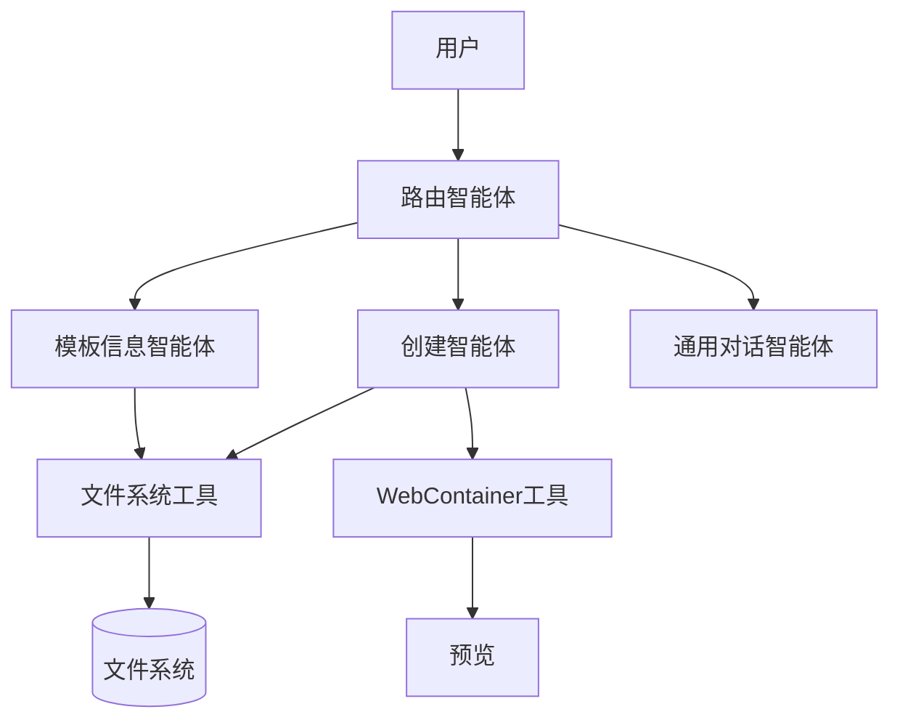
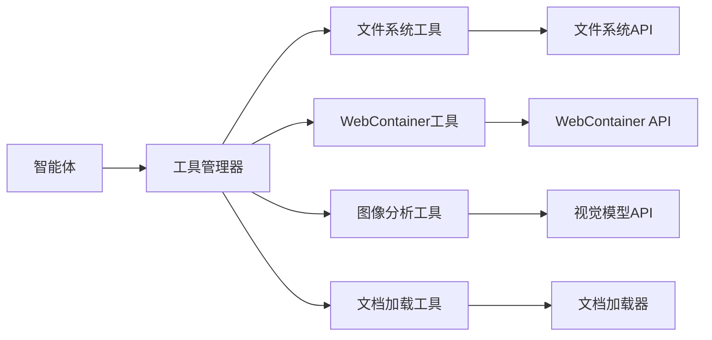
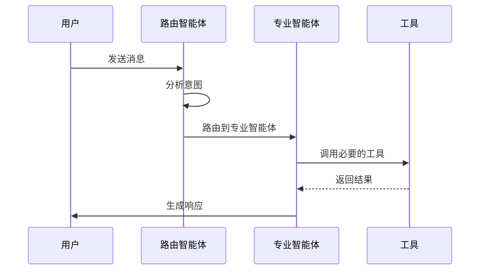
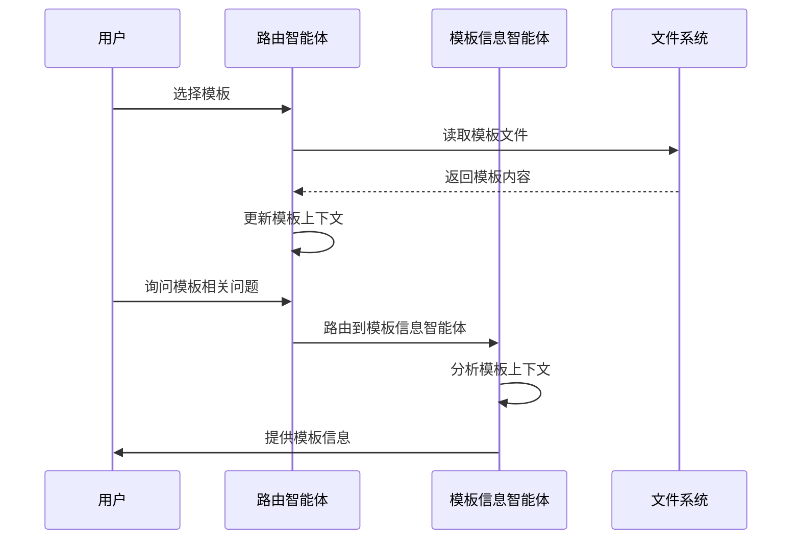
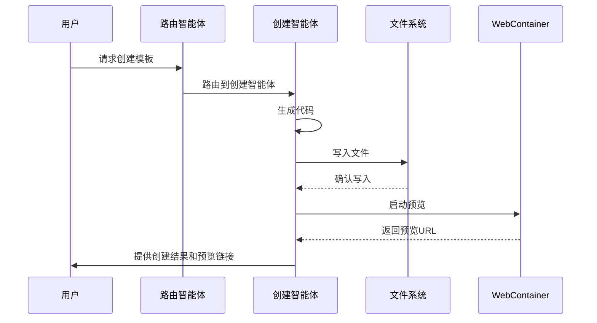

# LangGraph.js 重构计划

## 1. 浏览器兼容性分析

### 1.1 LangGraph.js 在 Web 环境中的兼容性

LangGraph.js 提供了专门为 Web 环境设计的入口点 `@langchain/langgraph/web`，解决了在浏览器中缺少 `async_hooks` API 的问题。这使得 LangGraph.js 可以在浏览器环境中运行，但有一些特殊考虑：

- **优点**：
  - 提供了与主包相同的功能，但不依赖于 Node.js 特定的 API
  - 支持在浏览器中构建复杂的智能体工作流
  - 可以与现有的前端框架无缝集成

- **注意事项**：
  - 在 Web 环境中使用时，需要手动传递 `config` 对象以支持追踪和回调功能
  - 需要确保不在前端暴露私有密钥（如 API 密钥）
  - 对于需要在客户端运行的模型，应考虑使用 WebLLM 等无需认证的解决方案

### 1.2 与当前项目的兼容性

当前项目基于 React 和 CodeMirror 构建，使用 LangChain.js 进行 AI 功能集成。迁移到 LangGraph.js 不会影响现有的 UI 组件和文件系统集成，只需要重构 AI 服务层。由于 LangGraph.js 提供了专门的 Web 兼容版本，因此可以无缝集成到现有的浏览器环境中。

## 2. LangGraph.js 的优势

### 2.1 相比 LangChain 的核心优势

1. **工作流编排能力**：
   - 基于图的工作流设计，使复杂的智能体行为更易于管理和理解
   - 支持条件分支、并行执行和循环等高级控制流
   - 更好地表达多步骤、多智能体交互的复杂逻辑

2. **状态管理**：
   - 内置的状态管理机制，简化了对话历史和上下文的处理
   - 支持持久化状态，便于实现长时间运行的工作流
   - 提供检查点功能，支持断点续传和时间旅行调试

3. **多智能体协作**：
   - 原生支持多智能体系统，便于实现专业化的智能体角色
   - 支持智能体之间的消息传递和协作
   - 提供监督机制，协调多个智能体的工作

4. **可观察性和调试**：
   - 提供详细的执行追踪和事件流
   - 支持流式处理中间步骤，提高用户体验
   - 便于识别和解决复杂工作流中的问题

5. **人机协作**：
   - 内置的人机交互支持，便于实现审批流程和人工干预
   - 支持在工作流的关键点暂停并等待人类输入

### 2.2 对当前项目的具体优势

1. **模板处理增强**：
   - 更好地管理模板上下文加载和查询处理的工作流
   - 清晰区分信息查询和创建请求的处理路径
   - 支持更复杂的模板理解和生成逻辑

2. **工具集成简化**：
   - 更直观地集成文件系统操作、WebContainer 预览等工具
   - 基于工具使用结果动态调整执行路径
   - 减少手动编写条件逻辑的需求

3. **多模态支持**：
   - 更容易集成图像分析、文档处理等多模态功能
   - 为不同类型的输入设计专门的处理路径

4. **对话管理改进**：
   - 更强大的会话历史管理和上下文保持
   - 支持多会话并行处理和状态隔离
   - 简化会话持久化和恢复逻辑

5. **可扩展性提升**：
   - 更容易添加新功能而不破坏现有逻辑
   - 支持渐进式迁移，可以逐步将功能从 LangChain 迁移到 LangGraph

## 3. 重构任务细分

### 3.1 核心功能设计

#### 3.1.1 智能体架构

我们将采用以下智能体架构：



1. **路由智能体**：
   - 分析用户输入，确定意图（查询信息、创建模板、一般对话）
   - 将请求路由到适当的专业智能体

2. **模板信息智能体**：
   - 处理关于模板结构、组件和功能的查询
   - 访问模板上下文，提供详细解释

3. **创建智能体**：
   - 处理模板创建和修改请求
   - 生成代码并与文件系统和 WebContainer 交互

4. **通用对话智能体**：
   - 处理不属于特定任务的一般对话
   - 维护对话上下文和历史

#### 3.1.2 状态设计

```typescript
// 核心状态定义
const GraphState = Annotation.Root({
  // 消息历史
  messages: Annotation<BaseMessage[]>({
    reducer: (x, y) => x.concat(y),
  }),
  // 当前模板上下文
  templateContext: Annotation<TemplateContext | null>({
    default: null,
  }),
  // 文件操作
  fileOperations: Annotation<FileOperation[]>({
    default: [],
    reducer: (x, y) => x.concat(y),
  }),
  // 预览状态
  preview: Annotation<PreviewState>({
    default: { shouldStartPreview: false, url: "" },
  }),
  // 工具调用历史
  toolCalls: Annotation<ToolCall[]>({
    default: [],
    reducer: (x, y) => x.concat(y),
  }),
});
```

#### 3.1.3 工具集成



我们将实现以下工具：

1. **文件系统工具**：
   - 读取文件
   - 写入文件
   - 列出目录
   - 创建目录

2. **WebContainer 工具**：
   - 启动预览
   - 安装依赖
   - 获取预览 URL

3. **图像分析工具**：
   - 分析上传的图像
   - 提取图像内容

4. **文档加载工具**：
   - 加载文档到上下文
   - 从文档中提取信息

### 3.2 交互流程设计

#### 3.2.1 基本对话流程



#### 3.2.2 模板加载和查询流程



#### 3.2.3 模板创建流程



### 3.3 实现方法

#### 3.3.1 目录结构

```
src/core/ai/
├── langgraph/              # LangGraph.js 集成
│   ├── agents/             # 智能体定义
│   │   ├── router.ts       # 路由智能体
│   │   ├── templateInfo.ts # 模板信息智能体
│   │   ├── creator.ts      # 创建智能体
│   │   └── general.ts      # 通用对话智能体
│   ├── state/              # 状态定义
│   │   ├── index.ts        # 主状态定义
│   │   └── types.ts        # 状态类型
│   ├── tools/              # 工具定义
│   │   ├── fileSystem.ts   # 文件系统工具
│   │   ├── webContainer.ts # WebContainer工具
│   │   ├── imageAnalysis.ts# 图像分析工具
│   │   └── documentLoader.ts# 文档加载工具
│   ├── workflows/          # 工作流定义
│   │   ├── main.ts         # 主工作流
│   │   ├── template.ts     # 模板处理工作流
│   │   └── creation.ts     # 创建工作流
│   └── index.ts            # 导出
├── hooks/                  # React钩子
│   ├── useLangGraph.ts     # LangGraph主钩子
│   ├── useAgents.ts        # 智能体钩子
│   └── useTools.ts         # 工具钩子
└── utils/                  # 工具函数
    ├── stateUtils.ts       # 状态工具
    └── streamUtils.ts      # 流处理工具
```

#### 3.3.2 核心组件实现

1. **主工作流**：

```typescript
// 创建主工作流
export function createMainWorkflow(model: BaseChatModel) {
  // 定义状态
  const state = GraphState;
  
  // 创建图
  const graph = new StateGraph(state)
    // 添加节点
    .addNode("router", createRouterNode(model))
    .addNode("templateInfo", createTemplateInfoNode(model))
    .addNode("creator", createCreatorNode(model))
    .addNode("general", createGeneralNode(model))
    
    // 添加边
    .addEdge(START, "router")
    .addConditionalEdges(
      "router",
      (state) => {
        const intent = state.intent;
        if (intent.isInfoRequest) return "templateInfo";
        if (intent.isCreationRequest) return "creator";
        return "general";
      },
      {
        "templateInfo": "templateInfo",
        "creator": "creator",
        "general": "general"
      }
    )
    .addEdge("templateInfo", END)
    .addEdge("creator", END)
    .addEdge("general", END);
  
  // 编译图
  return graph.compile();
}
```

2. **路由节点**：

```typescript
export function createRouterNode(model: BaseChatModel) {
  return async (state: typeof GraphState.State, config?: RunnableConfig) => {
    // 创建意图分析链
    const intentChain = createIntentAnalysisChain(model);
    
    // 分析最后一条消息
    const lastMessage = state.messages[state.messages.length - 1];
    const result = await intentChain.invoke({
      input: lastMessage.content,
      templateContext: state.templateContext
    }, config);
    
    // 返回意图分析结果
    return {
      intent: result
    };
  };
}
```

3. **工具集成**：

```typescript
export function createFileSystemTools(fileSystem: FileSystemInterface) {
  return {
    readFile: tool(async ({ path }) => {
      const content = await fileSystem.readFile(path);
      return content;
    }, {
      name: "readFile",
      description: "读取文件内容",
      schema: z.object({
        path: z.string().describe("文件路径"),
      }),
    }),
    
    writeFile: tool(async ({ path, content }) => {
      await fileSystem.writeFile(path, content);
      return `成功写入文件 ${path}`;
    }, {
      name: "writeFile",
      description: "写入文件内容",
      schema: z.object({
        path: z.string().describe("文件路径"),
        content: z.string().describe("文件内容"),
      }),
    }),
    
    // 其他文件系统工具...
  };
}
```

## 4. 迁移策略

### 4.1 渐进式迁移

为了降低风险，我们将采用渐进式迁移策略：

1. **阶段一：基础架构**
   - 实现 LangGraph.js 的基本集成
   - 创建核心状态和工作流定义
   - 实现简单的路由智能体

2. **阶段二：工具集成**
   - 集成文件系统工具
   - 集成 WebContainer 工具
   - 测试工具功能

3. **阶段三：专业智能体**
   - 实现模板信息智能体
   - 实现创建智能体
   - 实现通用对话智能体

4. **阶段四：高级功能**
   - 实现图像分析功能
   - 实现文档加载功能
   - 完善多智能体协作

5. **阶段五：优化和测试**
   - 优化性能和用户体验
   - 全面测试各种场景
   - 修复问题并完善文档

### 4.2 兼容性保障

为了确保迁移过程中的兼容性，我们将：

1. 保持现有的 API 接口，使上层组件无需大幅修改
2. 创建适配层，将 LangGraph.js 的输出转换为与 LangChain 兼容的格式
3. 使用特性标志，允许在运行时切换回 LangChain 实现

## 5. 总结

LangGraph.js 提供了强大的工作流编排能力，非常适合实现复杂的智能体系统。通过迁移到 LangGraph.js，我们可以更好地支持多智能体协作、工具集成和复杂交互流程，同时提高代码的可维护性和可扩展性。

渐进式迁移策略将帮助我们平稳过渡，同时保持系统的稳定性和可靠性。通过清晰的架构设计和详细的实现计划，我们可以确保迁移过程顺利进行，并最大限度地发挥 LangGraph.js 的优势。
