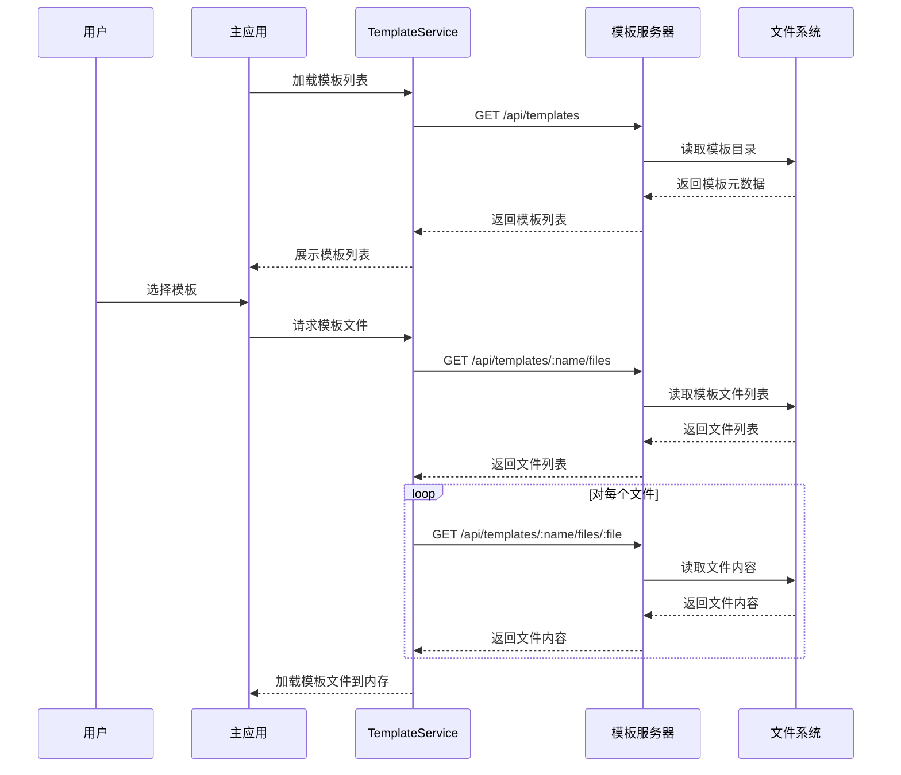

# vite-Goblite 技术方案

## 1. 项目概述

vite-Goblite 是一个基于浏览器的低代码平台，提供模板选择、在线编码和在线构建功能。用户可以选择预设的模板，在浏览器中编辑代码，并实时构建和预览应用。

## 2. 系统架构

项目采用 Monorepo 结构，使用 pnpm 进行包管理：

```
├── apps/               # 主应用和子应用容器
│   └── main-app/       # 主应用（负责子应用管理）
├── packages/           # 共享工具包
│   ├── core/           # 跨应用共享工具
│   ├── editor/         # 在线编辑代码实现
│   └── web-container/  # WebContainer 实现（浏览器端构建引擎）
├── templates/          # 前端应用模板库
│   ├── vue-template/   # Vue3 + Vite 模板
│   ├── react-template/ # React + Vite 模板
│   ├── server/         # 模板服务器，提供模板API
│   └── ...             # 其他模板
└── package.json        # Monorepo 根配置
```

### 2.1 核心组件

- **主应用 (main-app)**：用户交互的主界面，负责模板展示、选择和管理
- **WebContainer**：基于浏览器的构建引擎，负责构建和运行应用
- **Editor**：在线代码编辑器，提供代码编辑功能
- **核心工具包 (core)**：提供跨应用的共享功能
- **模板服务器 (templates/server)**：提供模板API，负责读取和提供模板文件

## 3. 技术栈

- **框架**：Vue 3 / React (取决于各子应用需求)
- **构建工具**：Vite
- **包管理器**：pnpm
- **Monorepo 工具**：pnpm workspace
- **TypeScript**：类型安全
- **Tailwind CSS**：样式系统
- **ESLint**：代码质量
- **WebContainer API**：浏览器内构建引擎
- **Monaco Editor**：代码编辑器

## 4. 组件设计

### 4.1 主应用 (main-app)

主应用是用户与系统交互的主要界面，负责以下功能：

- 模板展示和选择
- 应用构建和预览
- 编辑器集成
- 项目状态管理

**核心页面/组件**：
- `TemplateGallery`：展示可用模板列表
- `TemplateDetail`：显示模板详细信息
- `WorkspaceContainer`：集成编辑器和预览功能的工作区
- `BuildControls`：构建控制按钮和选项

### 4.2 WebContainer 组件封装

WebContainer 基于 [WebContainers API](https://webcontainers.io/)，提供浏览器内的构建和运行环境。

**核心功能**：
- 初始化 WebContainer 环境
- 加载项目文件
- 安装依赖
- 启动开发服务器
- 提供文件系统操作
- 终端输出捕获和展示

**核心组件/接口**：
- `WebContainerService`：WebContainer 核心服务
- `WebContainerProvider`：React/Vue Provider 组件
- `useWebContainer`：React Hook / Vue Composable
- `WebContainerPreview`：应用预览组件
- `WebContainerTerminal`：终端输出组件

### 4.3 编辑器设计

编辑器基于 Monaco Editor（VS Code 使用的编辑器），提供丰富的代码编辑功能。

**核心功能**：
- 代码编辑（支持多种语言）
- 语法高亮
- 代码补全
- 错误提示
- 文件树导航
- 搜索/替换
- 主题切换
- 快捷键支持

**核心组件**：
- `EditorService`：编辑器核心服务
- `EditorProvider`：React/Vue Provider 组件
- `useEditor`：React Hook / Vue Composable
- `CodeEditor`：代码编辑器组件
- `FileExplorer`：文件浏览器组件
- `EditorToolbar`：编辑器工具栏

### 4.4 核心工具包 (core)

核心工具包提供跨应用的共享功能。

**核心功能**：
- 模板加载和解析
- 文件系统抽象
- WebContainer 工具函数
- 项目配置解析和管理
- 事件总线
- 类型定义

**主要模块**：
- `TemplateService`：模板管理服务
- `FileSystemUtils`：文件系统操作工具
- `WebContainerUtils`：WebContainer 辅助工具
- `ProjectConfigService`：项目配置管理
- `EventBus`：事件总线实现
- `Types`：共享类型定义

### 4.5 模板服务器 (templates/server)

模板服务器提供API接口，负责读取和提供模板文件。

**核心功能**：
- 扫描模板目录，读取模板元数据
- 提供模板列表API
- 提供模板文件列表API
- 提供模板文件内容API
- 支持按需加载模板文件

**主要模块**：
- `TemplateService`：模板服务实现
- `API路由`：RESTful API接口

**API接口**：
- `GET /api/templates`：获取所有模板元数据
- `GET /api/templates/:name/files`：获取指定模板的文件列表
- `GET /api/templates/:name/files/:file`：获取指定模板的文件内容

**优势**：
- 减少网络传输量，按需加载文件
- 直接从文件系统读取，无需硬编码模板内容
- 便于部署和扩展
- 自动发现新增模板

## 5. 模板规范

每个模板必须遵循以下规范：

### 5.1 基本规范

- 包含 `package.json` 文件
- 使用 Vite 作为构建工具
- 提供标准的开发脚本 (`dev`, `build`, `preview`)
- 包含 `README.md` 文件说明模板使用方法
- 包含 `.gitignore` 文件

### 5.2 元数据规范

每个模板必须在根目录包含 `template.json` 文件，提供以下元数据：

```json
{
  "name": "Vue 3 Template",
  "description": "基于 Vue 3 和 Vite 的标准模板",
  "thumbnail": "thumbnail.png",
  "tags": ["vue", "typescript", "vite"],
  "framework": "vue",
  "language": "typescript",
  "dependencies": {
    "core": "^1.0.0",
    "vue": "^3.0.0",
    "..."
  },
  "devDependencies": {
    "vite": "^5.0.0",
    "..."
  },
  "scripts": {
    "dev": "vite",
    "build": "vite build",
    "preview": "vite preview"
  },
  "files": [
    "src/",
    "public/",
    "index.html",
    "vite.config.ts",
    "..."
  ]
}
```

### 5.3 目录结构规范

建议模板遵循如下目录结构：

```
├── public/              # 静态资源
├── src/                 # 源代码
│   ├── assets/          # 资源文件
│   ├── components/      # 组件
│   ├── pages/           # 页面
│   ├── App.(vue|tsx)    # 应用入口
│   └── main.(ts|js)     # 主入口文件
├── index.html           # HTML 入口
├── vite.config.(ts|js)  # Vite 配置
├── tsconfig.json        # TypeScript 配置
├── package.json         # 包配置
├── README.md            # 说明文档
└── template.json        # 模板元数据
```

## 6. 工作流程

### 6.1 模板选择与加载

1. 主应用启动时，调用 `TemplateService` 加载所有可用模板
2. `TemplateService` 通过API请求从模板服务器获取模板列表
3. 用户浏览模板列表并选择所需模板
4. 用户确认选择后，系统通过API从模板服务器获取模板文件
5. 获取到的模板文件加载到内存文件系统中



### 6.2 代码编辑

1. 编辑器加载模板文件并显示文件树
2. 用户通过文件树导航或直接在编辑器中打开文件
3. 用户编辑代码，编辑器提供语法高亮、代码补全等功能
4. 编辑的内容实时保存到内存文件系统

### 6.3 构建与预览

1. 用户完成编辑后点击构建按钮
2. WebContainer 初始化虚拟环境
3. 系统将编辑后的文件加载到 WebContainer
4. WebContainer 安装依赖并启动开发服务器
5. 预览组件连接到开发服务器并展示应用
6. 构建日志实时显示在终端组件中

### 6.4 持续编辑与构建

1. 用户可以继续编辑代码
2. 每次重要修改后，用户可以点击构建按钮重新触发构建
3. 系统更新 WebContainer 中的文件并重新启动服务器
4. 预览组件自动刷新显示最新构建结果

## 7. 实现计划

### 7.1 第一阶段：基础架构搭建

1. 初始化 Monorepo 结构
2. 配置 pnpm workspace
3. 设置基础构建工具 (TypeScript, ESLint, Tailwind)
4. 创建核心包 (core) 基础架构

### 7.2 第二阶段：核心功能实现

1. 实现模板服务 (TemplateService)
2. 实现 WebContainer 服务封装
3. 集成 Monaco Editor
4. 实现文件系统工具

### 7.3 第三阶段：应用实现

1. 开发主应用 UI
2. 实现模板选择流程
3. 集成编辑器和 WebContainer
4. 实现构建和预览功能

### 7.4 第四阶段：优化和完善

1. 性能优化
2. 用户体验改进
3. 错误处理和恢复机制
4. 文档完善

## 8. 技术挑战与解决方案

### 8.1 浏览器环境限制

**挑战**：在浏览器环境中构建和运行应用受到诸多限制

**解决方案**：
- 使用 WebContainers API 提供虚拟环境
- 针对浏览器环境优化构建过程
- 缓存依赖提高性能

### 8.2 性能优化

**挑战**：在浏览器中运行构建工具和编辑器可能导致性能问题

**解决方案**：
- 懒加载组件和功能
- 使用 Web Workers 进行密集计算
- 虚拟化长列表
- 优化文件系统操作

### 8.3 编辑器与 WebContainer 集成

**挑战**：编辑器和 WebContainer 需要无缝集成

**解决方案**：
- 设计清晰的接口和事件系统
- 使用观察者模式监听文件变化
- 实现统一的文件系统抽象层

## 9. 结论

vite-Goblite 项目将提供一个强大的浏览器内低代码平台，使用户能够选择模板、编辑代码并实时构建和预览应用。通过合理的架构设计和技术选型，项目能够提供流畅的用户体验和强大的功能。

通过模块化的设计和清晰的接口定义，项目可以灵活扩展，支持更多模板和功能。核心工具包的抽象使得各组件能够良好协作，为用户提供一体化的开发体验。

## 10. 实现进度

### 10.1 已完成功能

#### 10.1.1 项目结构调整

- 将 `web-container` 和 `editor` 子包从 `apps` 目录移至 `packages` 目录
- 保留 `main-app` 在 `apps` 目录中作为主应用

#### 10.1.2 核心包 (core) 实现

- **类型定义**：完成模板元数据、文件系统和构建信息的接口定义
- **事件总线**：实现基于发布-订阅模式的事件通信系统
- **文件系统工具**：实现文件读写、目录操作等功能
- **模板服务**：实现模板加载、过滤和管理功能
- **WebContainer 工具**：封装 WebContainer API，提供初始化、文件加载、依赖安装和服务启动等功能

#### 10.1.3 WebContainer 包实现

- **WebContainerProvider**：提供 WebContainer 状态和操作的上下文
- **WebContainerPreview**：实现应用预览组件
- **WebContainerTerminal**：实现终端输出组件，基于 xterm.js
- **WebContainer Hooks**：提供 React Hooks 用于访问 WebContainer 功能

#### 10.1.4 编辑器包实现

- **EditorProvider**：提供编辑器状态和操作的上下文
- **CodeEditor**：基于 Monaco Editor 实现代码编辑器组件
- **FileExplorer**：实现文件浏览器组件
- **Editor Hooks**：提供 React Hooks 用于访问编辑器功能

#### 10.1.5 主应用实现

- **页面路由**：实现主页、模板选择和编辑器页面的路由
- **布局组件**：实现应用的整体布局
- **首页**：展示平台介绍和主要功能
- **模板页面**：展示可用模板列表，支持过滤和选择
- **编辑器页面**：集成编辑器和 WebContainer，提供代码编辑和预览功能

### 10.2 待实现功能

#### 10.2.1 模板系统

- ~~创建示例模板~~
- 实现模板导入/导出功能
- 添加模板分类和标签系统

#### 10.2.2 编辑器增强

- 实现代码片段功能
- 添加主题切换
- 实现搜索/替换功能
- 添加编辑器设置面板

#### 10.2.3 WebContainer 增强

- 优化依赖安装性能
- 添加构建配置选项
- 实现项目导出功能

#### 10.2.4 用户体验优化

- 添加加载状态和进度指示
- 实现错误处理和恢复机制
- 优化移动设备适配
- 添加用户引导和帮助文档

### 10.3 下一步计划

1. 完善模板系统，创建更多模板
2. 增强编辑器功能，提高开发体验
3. 优化 WebContainer 性能，提高构建速度
4. 完善错误处理机制，提高系统稳定性
5. 添加单元测试和集成测试，确保代码质量

## 11. 最新进度更新

### 11.1 模板系统完善

#### 11.1.1 Vue 落地页模板

已完成 Vue 落地页模板的开发，包括以下内容：

- **基础配置**：
  - `template.json`：定义模板元数据，包括名称、描述、框架和语言等信息
  - `package.json`：配置项目依赖和脚本
  - `vite.config.ts`：Vite 构建工具配置
  - `tsconfig.json` 和 `tsconfig.node.json`：TypeScript 配置
  - `tailwind.config.js` 和 `postcss.config.js`：样式工具配置

- **核心组件**：
  - 布局组件：`Navbar.vue` 和 `Footer.vue`
  - UI 组件：`SectionHeader.vue`、`FeatureCard.vue`、`PricingCard.vue` 和 `TestimonialCard.vue`
  - 表单组件：`ContactForm.vue`

- **页面视图**：
  - `Home.vue`：主页面，包含英雄区域、特性展示、价格方案和客户评价等部分
  - `About.vue`：关于页面

- **资源文件**：
  - 图片资源：logo、英雄图像等
  - CSS 样式：基于 Tailwind CSS 的自定义样式

#### 11.1.2 模板集成

- 完成了模板在 `TemplatePage` 中的展示和筛选功能
- 实现了模板在 `EditorPage` 中的加载和编辑功能
- 集成了 WebContainer 用于构建和预览模板项目

### 11.2 下一步计划

1. 创建更多模板，如 React 模板、Angular 模板等
2. 完善 WebContainer 的初始化和文件加载流程
3. 优化编辑器体验，添加更多功能
4. 实现模板导出功能，允许用户下载完整项目
